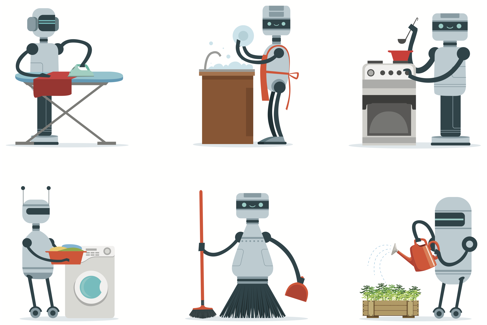

  

    

      

        <a href="#interactive_imitation">
          

            
            

              <h2 class="card-title text">Interactive Imitation Learning</h2>
              
Implicitly programming robots

            

          

        </a>
    

    

      

        <a href="#task_representation">
          

            
            

              <h2 class="card-title text">Task Representation Learning</h2>
              
Teaching robots new skills

            

          

        </a>
    

    

      

        <a href="#planning_humans">
          

            
            

              <h2 class="card-title text">Planning Alongside Humans</h2>
              
Interactions with human partners

            

          

        </a>
    

  

    

## Interactive Imitation Learning 

Often times, *explicitly programming* a robot can be very challenging. 
Imitation learning offers a more scalable option of *implicitly programming* robots through demonstrations, interventions or preferences. 
While we currently have simple algorithms with strong theory, they rely on a set of restrictive assumptions.
Notably, an optimal human expert who can interactively provide corrections on any state the robot visits. 
An everyday human user, however, presents a number of challenges:

1. **Mismatched capabilities:** A user may demonstrate a task that is beyond the robot's capabilities. Or, they may not be as efficient as a robot. Can we learn under such mismatch?

2. **Unobserved contexts:** Human feedback is often influenced by latent context (e.g. trust, attention) that the robot does not directly observe. How do we deal with such uncertainty? 

3. **Natural feedback:** Can we learn from natural modes of human feedback like language and gestures?  

<table>
    <tr>
        <td style="text-align: right;">
             
            
  

        </td>  
        <td style="padding:20px;width:75%;vertical-align:middle">
          <a href="https://gokul.dev/mmil/" target="_blank"><strong>Of Moments and Matching: Trade-offs and Treatments in Imitation Learning</strong></a>
           
          Gokul Swamy, <strong>Sanjiban Choudhury</strong>, Zhiwei Steven Wu, and J Andrew Bagnell
           
          <em>International Conference on Machine Learning (ICML)</em>, 2021
           
          <a href="https://gokul.dev/mmil/" target="_blank">project page</a> / 
          <a href="https://arxiv.org/abs/2103.03236" target="_blank">paper</a> /
          <a href="https://www.youtube.com/playlist?list=PL51kEpt5uSsbZSaGyUMsLsOoFP8-hyx0R" target="_blank">video</a> /
          <a href="https://github.com/gkswamy98/pillbox" target="_blank">code</a> 
          

          
All of imitation learning can be reduced to a game between a learner (generator) and a value function (discriminator) where the payoff is the performance difference between learner and expert. 

        </td>
    </tr>
    <tr>
        <td style="text-align: right;">
             
            
  

        </td>  
        <td style="padding:20px;width:75%;vertical-align:middle">
          <a href="https://arxiv.org/abs/2102.02872" target="_blank"><strong>Feedback in Imitation Learning: The Three Regimes of Covariate Shift</strong></a>
           
          Jonathan Spencer, <strong>Sanjiban Choudhury</strong>, Arun Venkatraman, Brian Ziebart, and J Andrew Bagnell 
           
          <em>arXiv preprint arXiv:2102.02872</em>, 2021
           
          <a href="https://arxiv.org/abs/2102.02872" target="_blank">paper</a> /
          <a href="https://www.youtube.com/watch?v=4VAwdCIBTG8&feature=youtu.be" target="_blank">talk</a>
          

          
Not all imitation learning problems are alike -- some are easy (do behavior cloning), some are hard (call interactive expert), and some are just right (just need a simulator). 

        </td>
      </tr>
      <tr>
        <td style="text-align: right;">
             
            
  

        </td>  
        <td style="padding:20px;width:75%;vertical-align:middle">
          <a href="http://www.roboticsproceedings.org/rss16/p055.pdf" target="_blank"><strong>Learning from Interventions: Human-robot interaction as both explicit and implicit feedback</strong></a>
           
          Jonathan Spencer, <strong>Sanjiban Choudhury</strong>, Matt Barnes and Siddhartha Srinivasa 
           
          <em>Robotics: Science and Systems (RSS)</em>, 2020
           
          <a href="http://www.roboticsproceedings.org/rss16/p055.pdf" target="_blank">paper</a> /
          <a href="https://www.youtube.com/watch?v=NjkcgB-yy0w" target="_blank">talk</a> 
          

          
 How can we learn from human interventions? Every intervention reveals some information about expert's implicit value function. Infer this function and optimize it. 

        </td>
      </tr>
      <tr>
        <td style="text-align: right;">
             
            
  

        </td>  
        <td style="padding:20px;width:75%;vertical-align:middle">
          <a href="https://arxiv.org/abs/1905.12888" target="_blank"><strong>Imitation Learning as f-Divergence Minimization</strong></a>
           
          Liyiming Ke, <strong>Sanjiban Choudhury</strong>, Matt Barnes, Wen Sun, Gilwoo Lee and Siddhartha Srinivasa
           
          <em>Workshop on the Algorithmic Foundations of Robotics (WAFR)</em>, 2020
           
          <a href="https://arxiv.org/abs/1905.12888" target="_blank">paper</a>
          

          
 Many old (and new!) imitation learning algorithms are simply minimizing various <i>f</i>-divergences estimates between the expert and the learner trajectory distributions. 

        </td>
      </tr>
</table>

 

    

## Task Representation Learning

We want personal robots that come with a repertoire of skills that can be composed to solve any boutique task in our homes. Every home is different, every human is different. Robots must be able to learn new tasks from a handful of demonstrations and interactions with the human user. Abstractly, one can think of a task as -- given an initial configuration of objects, reach a desired goal configuration following a series of feasible operations that do not violate constraints. Learning both the goal and constraints comes with a number of challenges:

1. **Skill Composition**: Given a library of skills, can we label and learn demonstrated tasks as a composition of known skills?

2. **Limited Labels**: Getting large amounts of labelled data for every new task can be expensive. How can we leverage *unlabelled* data collected from multiple tasks that share sub-tasks in common? 

3. **Learning Structure**: Instead of memorizing a task as a sequence of operations, can we learn the underlying structure of the task, i.e. common sub-goals, invariances and dependencies? 

 

    

## Planning Alongside Humans

For robots to work seamlessly alongside human partners, they must operate in a safe and legible manner while matching human cadence. 
The fundamental challenge is *uncertainty*. Robots are uncertain about the intent of their human partners, and how this intent changes based on the robot's actions. Modelling this uncertainty and planning with it in real-time presents a set of challenges: 

1. **Discrete modes**: Theoretically, planning under uncertainty over continuous spaces is intractable. But humans do this everyday by chunking up the continuous space of actions into discrete modes. What are these modes and how do we learn them?

2. **Hedging v/s Asserting**: In much of driving, humans fluidly trade-off between hedging against uncertain outcomes and assertive actions that collapse uncertainty. How do we learn this trade-off and can we generalize this broadly across human robot interactions?

3. **Hierarchy of Abstractions**: Robots must deal with uncertainty at multiple time-scales. How can we learn a hierarchy of plannable abstractions to continually build and refine an estimate of the value function?

<table>
  <tr>
    <td style="text-align: right;">
         
        
  

    </td>  
    <td style="padding:20px;width:75%;vertical-align:middle">
      <a href="https://arxiv.org/abs/2002.03042" target="_blank"><strong> Bayesian Residual Policy Optimization: Scalable Bayesian Reinforcement Learning with Clairvoyant Experts</strong></a>
       
      Gilwoo Lee, Brian Hou, <strong>Sanjiban Choudhury</strong> and Siddhartha S. Srinivasa
       
      <em>IEEE/RSJ International Conference on Intelligent Robots and Systems (IROS)</em>, 2021
       
      <a href="https://arxiv.org/abs/2002.03042" target="_blank">paper</a> / 
      <a href="https://www.youtube.com/watch?v=-AqMvXtW37Y" target="_blank">talk</a>
      

      
 
        In Bayesian RL, while solving the belief MDP is hard, solving individual latent MDP is easy. Combine value functions from each MDP along with a learned residual belief policy.    
      

    </td>
  </tr>

  <tr>
    <td style="text-align: right;">
         
        
  

    </td>  
    <td style="padding:20px;width:75%;vertical-align:middle">
      <a href="https://arxiv.org/abs/2002.11853" target="_blank"><strong>Posterior Sampling for Anytime Motion Planning on Graphs with Expensive-to-Evaluate Edges</strong></a>
       
      Brian Hou, <strong>Sanjiban Choudhury</strong>, Gilwoo Lee, Aditya Mandalika, and Siddhartha Srinivasa
       
      <em>IEEE International Conference on Robotics and Automation (ICRA)</em>, 2020
       
      <a href="https://arxiv.org/abs/2002.11853" target="_blank">paper</a> /
      <a href="https://www.youtube.com/watch?v=1DYZ_mseL3c" target="_blank">video</a>
      

      
 Anytime motion planning can be viewed through a Bayesian lens where we are initially uncertain about the shortest path, and must probe the environment to progressively yield shorter and shorter paths.
      

    </td>
  </tr>

  <tr>
    <td style="text-align: right;">
         
        
  

    </td>  
    <td style="padding:20px;width:75%;vertical-align:middle">
      <a href="https://arxiv.org/abs/2002.11853" target="_blank"><strong>Generalized Lazy Search for Robot Motion Planning: Interleaving Search and Edge Evaluation via Event-based Toggles</strong></a>
       
      Aditya Mandalika, <strong>Sanjiban Choudhury</strong>, Oren Salzman and Siddhartha Srinivasa
       
      <em>International Conference on Automated Planning and Scheduling (ICAPS)</em>, 2019
       
      <b>
           Best Student Paper Award
      </b>  
      <a href="../publications/docs/conferences/mandalika_icaps2019.pdf" target="_blank">paper</a> /
      <a href="https://arxiv.org/abs/1904.02795" target="_blank">long paper</a>
      

      
 Unified framework for interleaving search and edge evaluation to provably minimize total planning time. 
      

    </td>
  </tr>

  <tr>
  <td style="text-align: right;">
       
      
  

  </td>  
  <td style="padding:20px;width:75%;vertical-align:middle">
    <a href="../publications/docs/conferences/saund_isrr2019.pdf" target="_blank"><strong>The Blindfolded Robot : A Bayesian Approach to Planning with Contact Feedback</strong></a>
     
    Brad Saund, <strong>Sanjiban Choudhury</strong>, Siddhartha Srinivasa, and Dmitry Berenson. 
     
    <em>International Symposium on Robotics Research (ISRR)</em>, 2019
     
    <a href="../publications/docs/conferences/saund_isrr2019.pdf" target="_blank">paper</a> /
    <a href="https://www.youtube.com/watch?v=DlNhtBnF6ro" target="_blank">video</a>
    

    
 
      Casts manipulation under occlusion as a search on a graph where feasibility of an edge is only revealed when an agent attempts to traverse it. Use Bayesian prior to explore exploit.
    

  </td>
</tr>

</table>
