<!-- 

  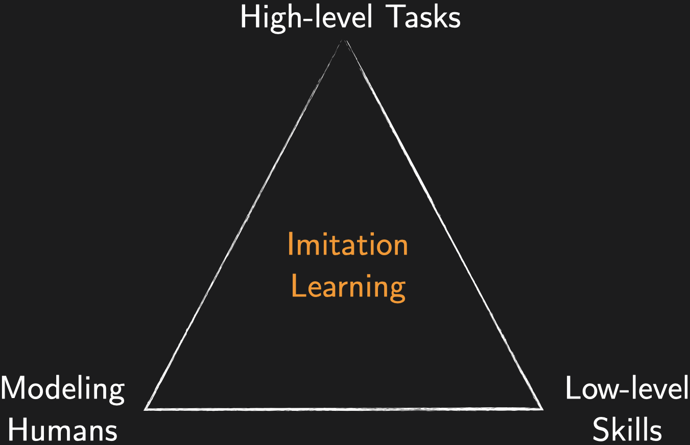

   -->

We work on interactive AI agents that self-align through few-shot interactions with humans and their environment. Our research focuses on reinforcement learning, imitation learning and foundation models for robotics, agents and code generation.

### Projects

<table>
    <tr>
        <td style="text-align: right;">
             
            
  

        </td>   
        <td style="padding:20px;width:75%;vertical-align:middle">
          <strong>Multi-Turn Code Generation Through Single-Step Rewards</strong>
           
          Arnav Kumar Jain*, Gonzalo Gonzalez-Pumariega*, Wayne Chen, Alexander M Rush, Wenting Zhao†, Sanjiban Choudhury†
           
          <!-- <em>International Conference on Machine Learning (ICML)</em>, 2024 -->
           
          <a href="https://arxiv.org/abs/2502.20380" target="_blank">paper</a> /
          <a href="https://portal-cornell.github.io/muCode/" target="_blank">website</a> 
          

          

          μCode is a simple and scalable method for multi-turn code generation leveraging learned verifiers.
          

        </td>
    </tr>
    <tr>
        <td style="text-align: right;">
             
            
 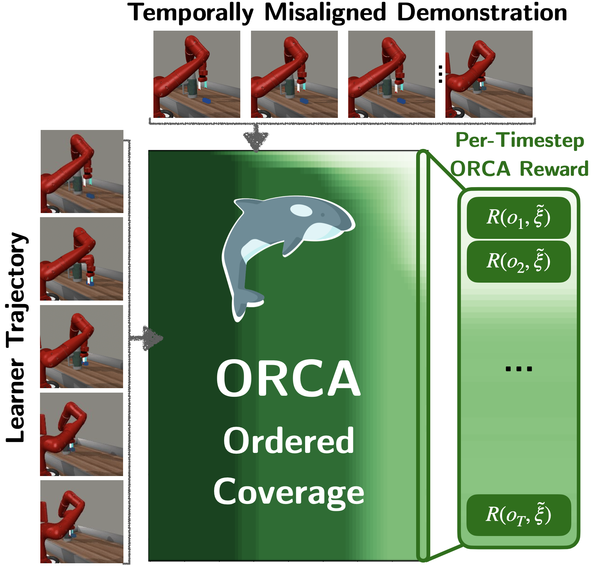 

        </td>   
        <td style="padding:20px;width:75%;vertical-align:middle">
          <strong>Imitation Learning from a Single Temporally Misaligned Video</strong>
           
          William Huey*, Huaxiaoyue Wang*, Anne Wu, Yoav Artzi, Sanjiban Choudhury
           
          <!-- <em>International Conference on Machine Learning (ICML)</em>, 2024 -->
           
          <a href="https://arxiv.org/pdf/2502.05397" target="_blank">paper</a>
          <!-- <a href="https://portal.cs.cornell.edu/rhyme/" target="_blank">website</a>  -->
          

          

          ORCA (ORdered Coverage Alignment) formulates rewards as an ordered coverage problem, enabling robots to learn from a single temporally misaligned video demonstration.
          

        </td>
    </tr>
    <tr>
        <td style="text-align: right;">
             
            
  

        </td>   
        <td style="padding:20px;width:75%;vertical-align:middle">
          <strong>Motion Tracks: A Unified Representation for Human-Robot Transfer in Few-Shot Imitation Learning</strong>
           
          Juntao Ren, Priya Sundaresan, Dorsa Sadigh, Sanjiban Choudhury, Jeannette Bohg
           
          <em>International Conference on Robotics and Automation (ICRA)</em>, 2025
           
          <a href="https://arxiv.org/abs/2501.06994" target="_blank">paper</a> /
          <a href="https://portal.cs.cornell.edu/motion_track_policy/" target="_blank">website</a> 
          

          

          Motion-Track Policy (MT-PI) presents a unified action space by representing actions as 2D trajectories on an image, enabling the robots to directly imitate from cross-embodiment datasets.
          

        </td>
    </tr>
    <tr>
        <td style="text-align: right;">
             
            
 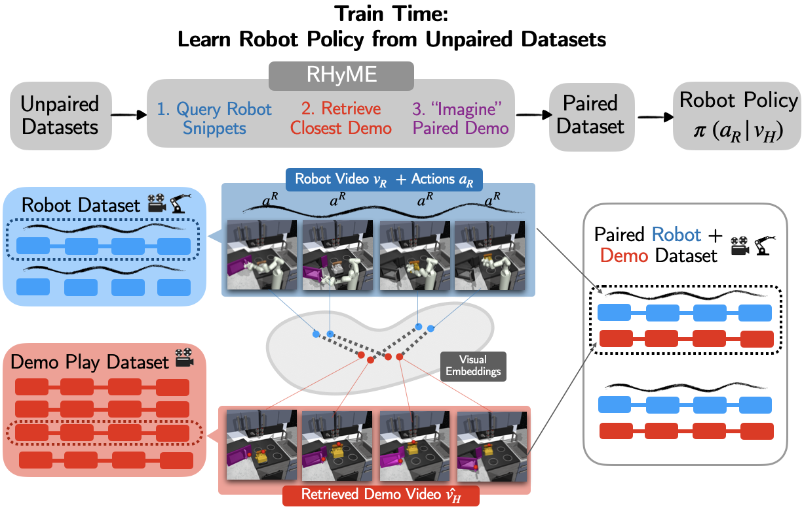 

        </td>   
        <td style="padding:20px;width:75%;vertical-align:middle">
          <strong>One-Shot Imitation under Mismatched Execution</strong>
           
          Kushal Kedia, Prithwish Dan, Angela Chao, Maximus Adrian Pace, Sanjiban Choudhury
           
          <em>International Conference on Robotics and Automation (ICRA)</em>, 2025
           
          <a href="https://arxiv.org/abs/2409.06615" target="_blank">paper</a> /
          <a href="https://portal.cs.cornell.edu/rhyme/" target="_blank">website</a> 
          

          

          RHyME introduces a new framework that enables robots to learn from watching human demonstrations even when there are differences in execution styles.
          

        </td>
    </tr>
    <tr>
        <td style="text-align: right;">
             
            
 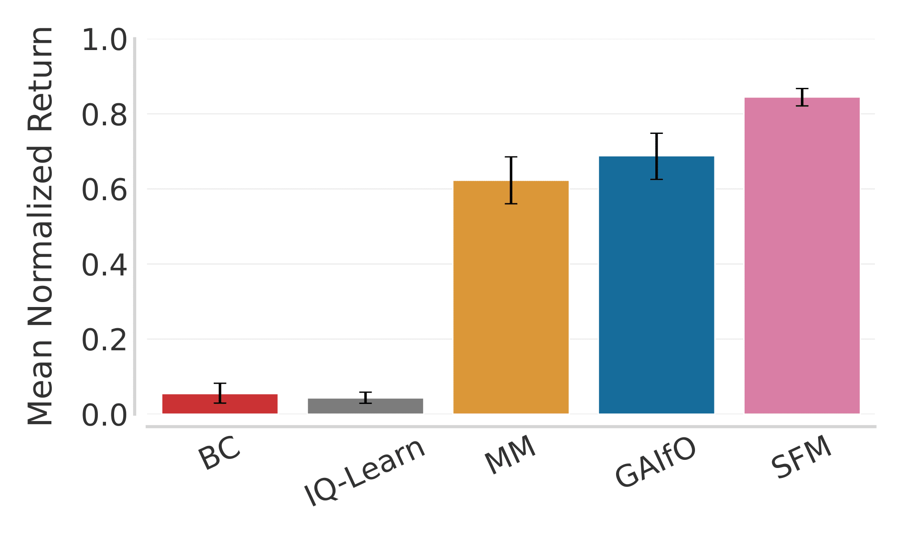 

        </td>   
        <td style="padding:20px;width:75%;vertical-align:middle">
          <strong>Non-Adversarial Inverse Reinforcement Learning via Successor Feature Matching</strong>
           
          Arnav Kumar Jain, Harley Wiltzer, Jesse Farebrother, Irina Rish, Glen Berseth, Sanjiban Choudhury
           
          <em>International Conference on Learning Representations (ICLR)</em>, 2025
           
          <a href="https://arxiv.org/abs/2411.07007" target="_blank">paper</a> /
          <a href="https://arnavkj1995.github.io/SFM/" target="_blank">website</a> 
          

          

          SFM (Successor Feature Matching) presents a non-adversarial approach for inverse reinforcement learning (IRL) and can learn from state-only demonstrations.
          

        </td>
    </tr>
    <tr>
        <td style="text-align: right;">
             
            
  

        </td>   
        <td style="padding:20px;width:75%;vertical-align:middle">
          <strong>Robotouille: An Asynchronous Planning Benchmark for LLM Agents</strong>
           
          Gonzalo Gonzalez-Pumariega, Leong Su Yean, Neha Sunkara, Sanjiban Choudhury
           
          <em>International Conference on Learning Representations (ICLR)</em>, 2025
           
          <a href="https://arxiv.org/abs/2502.05227" target="_blank">paper</a> /
          <a href="https://portal-cornell.github.io/robotouille/" target="_blank">website</a> 
          

          

          Robotouille is a challenging benchmark that tests LLM agents synchronous and asynchronous planning capabilities through diverse long-horizon tasks and time delays.
          

        </td>
    </tr>
    <tr>
        <td style="text-align: right;">
        
 
            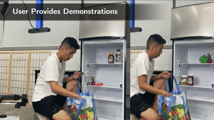 
        

        <!-- New Image Tag Below -->
        

            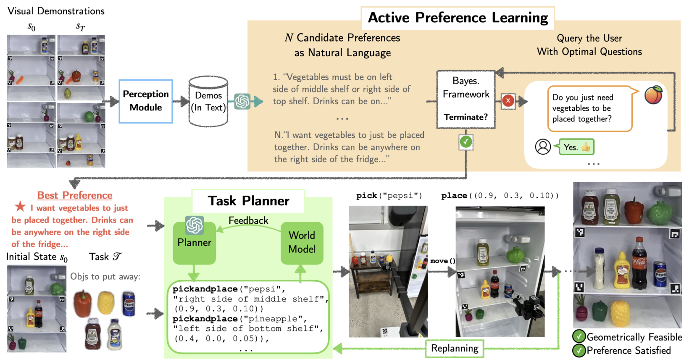
        

        </td>   
        <td style="padding:20px;width:75%;vertical-align:middle">
          <strong>APRICOT: Active Preference Learning and Constraint-Aware Task Planning with LLMs</strong>
           
          Yuki Wang, Nathaniel Chin, Gonzalo Gonzalez-Pumariega, and Xiangwan Sun, Neha Sunkara, Maximus Adrian Pace, Jeannette Bohg, Sanjiban Choudhury
           
          <em>Conference on Robot Learning (CoRL)</em>, 2024
           
          <a href="https://arxiv.org/abs/2410.19656" target="_blank">paper</a> /
          <a href="https://portal-cornell.github.io/apricot/" target="_blank">website</a> 
          

          

          APRICOT combines the generative ability of LLMs with Bayesian active preference learning, allowing robots to interactively query users to reduce uncertainty.
          

        </td>
      </tr>
    <tr>
    <tr>
        <!-- <td style="text-align: right;">
             
            
  

        </td>   -->
        <td style="text-align: right;">
        
 
             
        

        <!-- New Image Tag Below -->
        

            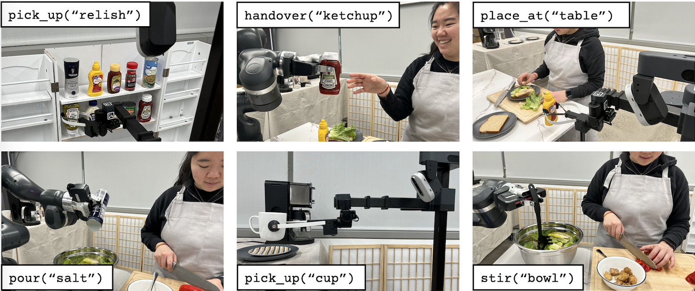
        

        </td> 
        <td style="padding:20px;width:75%;vertical-align:middle">
          <strong>MOSAIC: A Modular System for Assistive and Interactive Cooking</strong>
           
          Yuki Wang*, Kushal Kedia*, Juntao Ren*, Rahma Abdullah, Atiksh Bhardwaj, Angela Chao, Kelly Y Chen, Nathaniel Chin, Prithwish Dan, Xinyi Fan, Gonzalo Gonzalez-Pumariega, Aditya Kompella, Maximus Adrian Pace, Yash Sharma, Xiangwan Sun, Neha Sunkara, Sanjiban Choudhury
           
          <em>Conference on Robot Learning (CoRL)</em>, 2024
           
          <a href="https://arxiv.org/abs/2402.18796" target="_blank">paper</a> /
          <a href="https://portal-cornell.github.io/MOSAIC/" target="_blank">website</a> 
          

          

          MOSAIC combines large pre-trained models for general tasks with task-specific modules to enable collaborative cooking.
          

        </td>
      </tr>
    <tr>
    <tr>
        <td style="text-align: right;">
             
            
 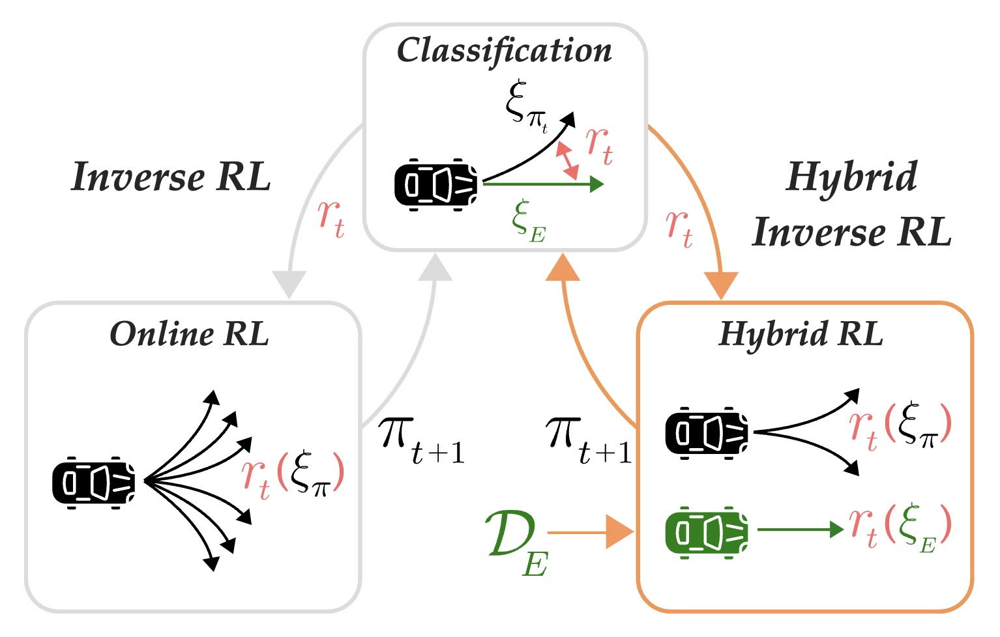 

        </td>  
        <td style="padding:20px;width:75%;vertical-align:middle">
          <strong>Hybrid Inverse Reinforcement Learning</strong>
           
          Juntao Ren, Gokul Swamy, Zhiwei Steven Wu, J. Andrew Bagnell, Sanjiban Choudhury
           
          <em>International Conference on Machine Learning (ICML)</em>, 2024
           
          <a href="https://arxiv.org/pdf/2402.08848.pdf" target="_blank">paper</a> 
          <a href="https://gokul.dev/hyper/" target="_blank">website</a> 
          

          

          Hybrid IRL trains policies on a mixture of online and expert data to mitigate exploration.  
          

        </td>
      </tr>
    <tr>
    <tr>
        <td style="text-align: right;">
             
            
  

        </td>  
        <td style="padding:20px;width:75%;vertical-align:middle">
          <strong>InteRACT: Transformer Models for Human Intent Prediction Conditioned on Robot Actions</strong>
           
          Kushal Kedia, Atiksh Bhardwaj, Prithwish Dan, Sanjiban Choudhury
           
          <em>International Conference on Robotics and Automation (ICRA)</em>, 2024
           
          <a href="https://arxiv.org/pdf/2311.12943.pdf" target="_blank">paper</a> /
          <a href="https://portal-cornell.github.io/interact/" target="_blank">website</a> 
          

          

          Interact, predicts human intent conditioned on future robot actions for collaborative manipulation.  
          

        </td>
      </tr>
    <tr>
    <tr>
        <td style="text-align: right;">
             
            
 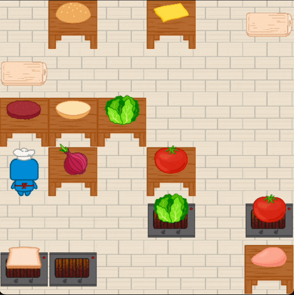 

        </td>  
        <td style="padding:20px;width:75%;vertical-align:middle">
          <strong>Demo2Code: From Summarizing Demonstrations to Synthesizing Code via Extended Chain-of-Thought</strong>
           
          Yuki Wang, Gonzalo Gonzalez-Pumariega, Yash Sharma, Sanjiban Choudhury
           
          <em>Advances in Neural Information Processing Systems (NeurIPS)</em>, 2023
           
          <a href="https://arxiv.org/abs/2305.16744" target="_blank">paper</a> /
          <a href="https://portal-cornell.github.io/demo2code/" target="_blank">website</a> 
          

          

          Demo2Code leverages LLMs to translate demonstrations to robot task code via an extended chain-of-thought that recursively summarizes demos to specification, and recursively expands specification to code.
          

        </td>
      </tr>
    <tr>
      <tr>
        <td style="text-align: right;">
             
            
 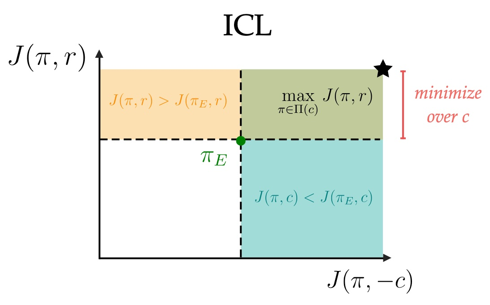 

        </td>  
        <td style="padding:20px;width:75%;vertical-align:middle">
          <strong>Learning Shared Safety Constraints from Multi-task Demonstrations</strong>
           
          Konwoo Kim, Gokul Swamy, Zuxin Liu, Ding Zhao, Sanjiban Choudhury, Steven Wu
           
          <em>Advances in Neural Information Processing Systems (NeurIPS)</em>, 2023
           
          <a href="https://arxiv.org/pdf/2309.00711.pdf" target="_blank">paper</a> /
          <a href="https://gokul.dev/icl/" target="_blank">website</a> 
          

          

          MT-ICL learns safety constraints from expert demonstrations across multiple tasks.
          

        </td>
      </tr>
    <tr>
    <tr>
        <td style="text-align: right;">
             
            
  

        </td>  
        <td style="padding:20px;width:75%;vertical-align:middle">
          <strong>ManiCast: Collaborative Manipulation with Cost-Aware Human Forecasting</strong>
           
          Kushal Kedia, Prithwish Dan, Atiksh Bhardwaj, Sanjiban Choudhury
           
          <em>Conference on Robot Learning (CoRL)</em>, 2023
           
          <a href="https://arxiv.org/pdf/2310.13258.pdf" target="_blank">paper</a> /
          <a href="https://portal-cornell.github.io/manicast/" target="_blank">website</a> 
          

          

          ManiCast learns forecasts of human motions and plans with such forecasts to solve collaborative manipulation tasks.  
          

        </td>
      </tr>
    <tr>
    <tr>
        <td style="text-align: right;">
             
            
 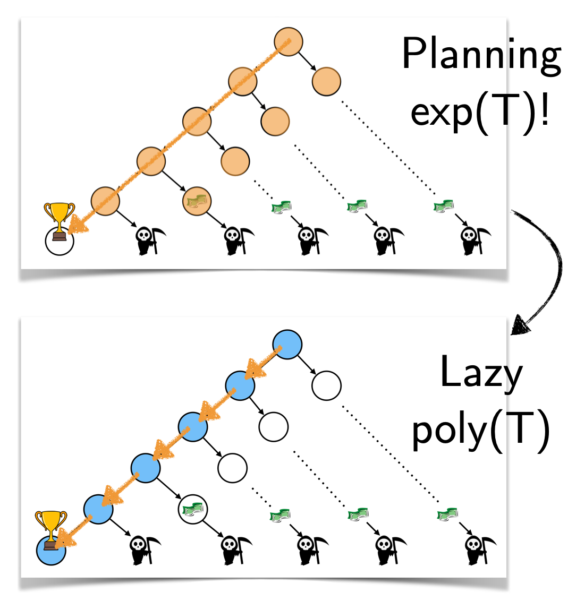 

        </td>  
        <td style="padding:20px;width:75%;vertical-align:middle">
          <strong>The Virtues of Laziness in Model-based RL: A Unified Objective and Algorithms</strong>
           
          Anirudh Vemula, Yuda Song, Aarti Singh, J. Andrew Bagnell, Sanjiban Choudhury
           
          <em>International Conference on Machine Learning (ICML)</em>, 2023
           
          <a href="https://proceedings.mlr.press/v202/vemula23a/vemula23a.pdf" target="_blank">paper</a>  
          

          
We propose a novel, lazy approach that addresses two fundamental challenges in Model-based Reinforcement Learning (MBRL): the computational expense of repeatedly finding a good policy in the learned model, and the objective mismatch between model fitting and policy computation. 

        </td>
      </tr>
    <tr>
    <tr>
        <td style="text-align: right;">
             
            
 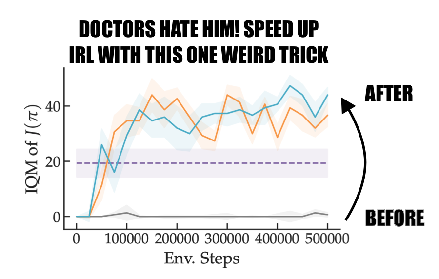 

        </td>  
        <td style="padding:20px;width:75%;vertical-align:middle">
          <strong>Inverse Reinforcement Learning without Reinforcement Learning</strong>
           
          Gokul Swamy, Sanjiban Choudhury, J Andrew Bagnell, and Zhiwei Steven Wu
           
          <em>International Conference on Machine Learning (ICML)</em>, 2023
           
          <a href="https://proceedings.mlr.press/v202/swamy23a/swamy23a.pdf" target="_blank">paper</a> /
          <a href="https://gokul.dev/filter/" target="_blank">website</a> 
          

          
We explore inverse reinforcement learning and show that leveraging the state distribution of the expert can significantly reduce the complexities of the RL problem, theoretically providing an exponential speedup and practically enhancing performance in continuous control tasks. 

        </td>
      </tr>
    <tr>
      <tr>
        <td style="text-align: right;">
             
            
 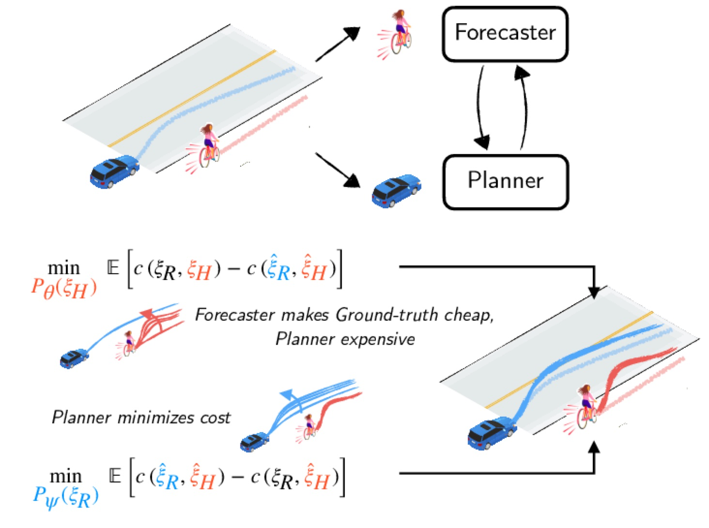 

        </td>  
        <td style="padding:20px;width:75%;vertical-align:middle">
          <strong>A Game-Theoretic Framework for Joint Forecasting and Planning</strong>
           
          Kushal Kedia, Prithwish Dan, Sanjiban Choudhury
           
          <em>IEEE/RSJ International Conference on Intelligent Robots and Systems (IROS)</em>, 2023
           
          <a href="https://arxiv.org/pdf/2308.06137.pdf" target="_blank">paper</a> /
          <a href="https://portal-cornell.github.io/game-theoretic-forecasting-planning/" target="_blank">website</a> 
          

          

          We propose a novel game-theoretic framework for joint planning and forecasting with the payoff being the performance of the planner against the demonstrator, and present practical algorithms to train models in an end-to-end fashion.  
          

        </td>
      </tr>
    <tr>
  <tr>
        <td style="text-align: right;">
             
            
 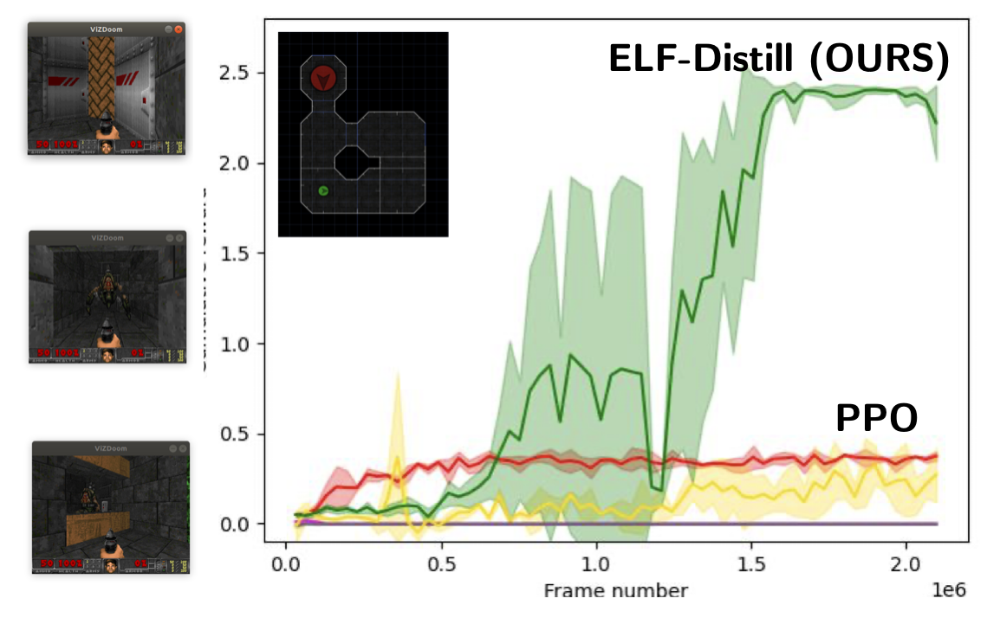 

        </td>  
        <td style="padding:20px;width:75%;vertical-align:middle">
          <a href="https://arxiv.org/abs/2102.02872" target="_blank"><strong>Impossibly Good Experts and How to Follow Them</strong></a>
           
          Aaron Walsman, Muru Zhang, Sanjiban Choudhury, Dieter Fox, Ali Farhadi
           
          <em>International Conference on Learning Representations (ICLR)</em>, 2023
           
          <a href="https://openreview.net/pdf?id=sciA_xgYofB" target="_blank">paper</a>
          

          
We investigate sequential decision making with "Impossibly Good" experts possessing privileged information, propose necessary criteria for an optimal policy recovery within limited information, and introduce a novel approach, ELF Distillation, outperforming baselines in Minigrid and Vizdoom environments. 

        </td>
      </tr>
    <tr>
        <td style="text-align: right;">
             
            
 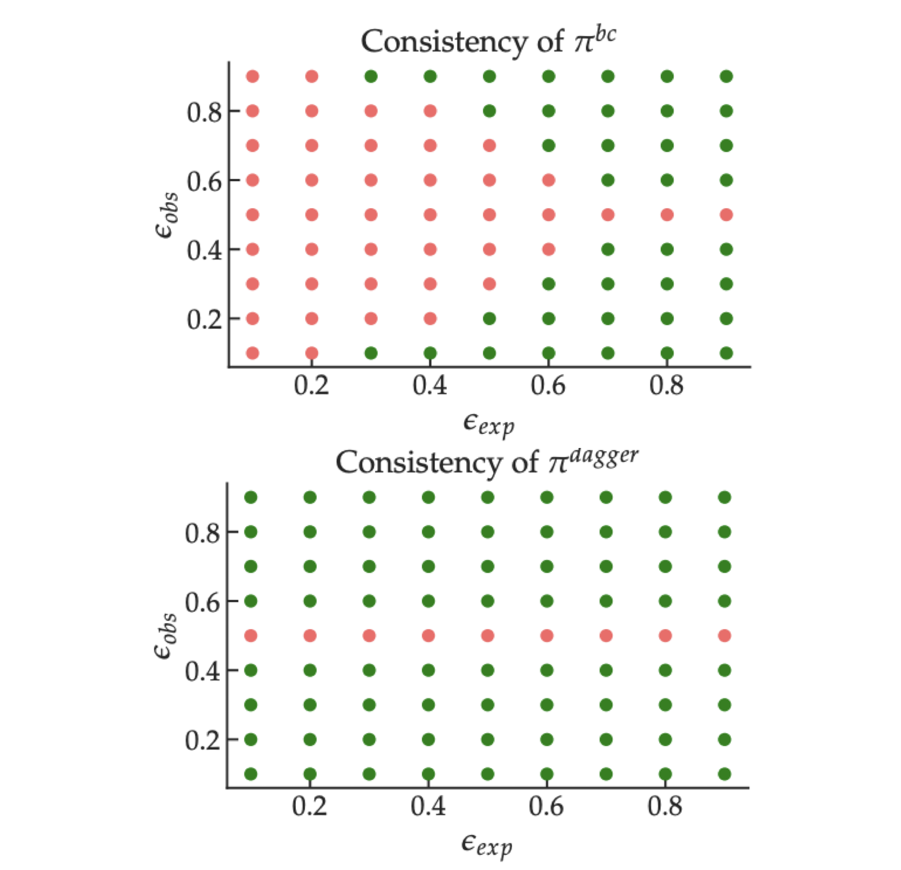 

        </td>  
        <td style="padding:20px;width:75%;vertical-align:middle">
          <strong>Sequence Model Imitation Learning with Unobserved Contexts</strong>
           
          Gokul Swamy, Sanjiban Choudhury, Zhiwei Steven Wu, and J Andrew Bagnell
           
          <em>Advances in Neural Information Processing Systems (NeurIPS)</em>, 2022
           
          <a href="https://arxiv.org/pdf/2208.02225.pdf" target="_blank">paper</a>  
          

          
We study imitation learning when the expert has privileged information and show that on-policy algorithms provably learn to recover from their initially suboptimal actions, while off-policy methods naively repeat the past action. 

        </td>
      </tr>
    <tr>
    <tr>
        <td style="text-align: right;">
             
            
 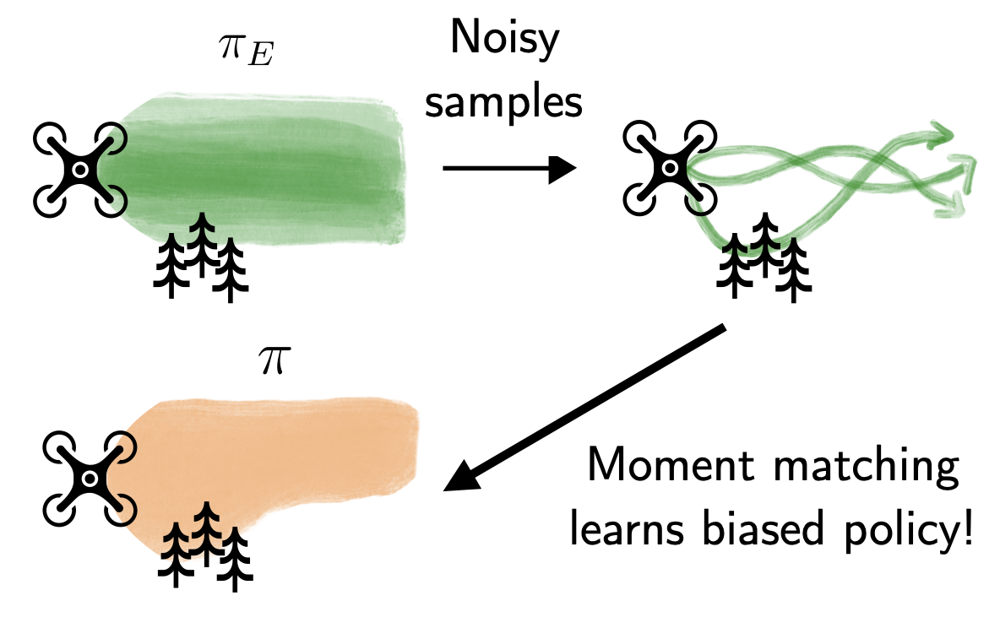 

        </td>  
        <td style="padding:20px;width:75%;vertical-align:middle">
          <strong>Minimax optimal online imitation learning via replay estimation</strong>
           
          Gokul Swamy, Nived Rajaraman, Matt Peng, Sanjiban Choudhury, J Bagnell, Steven Z Wu, Jiantao Jiao, Kannan Ramchandran
           
          <em>Advances in Neural Information Processing Systems (NeurIPS)</em>, 2022
           
          <a href="https://proceedings.neurips.cc/paper_files/paper/2022/file/2e809adc337594e0fee330a64acbb982-Paper-Conference.pdf" target="_blank">paper</a>  
          

          
 Imitation learning from noisy experts leads to biased policies! Replay estimation fixes this by smoothing the expert by repeatedly executing cached expert actions in a stochastic simulator and imitating that. 

        </td>
      </tr>
    <tr>
      <tr>
        <td style="text-align: right;">
             
            
 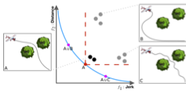 

        </td>  
        <td style="padding:20px;width:75%;vertical-align:middle">
          <strong>Towards Uniformly Superhuman Autonomy via Subdominance Minimization</strong>
           
          Brian Ziebart, Sanjiban Choudhury, Xinyan Yan, and Paul Vernaza
           
          <em>International Conference on Machine Learning (ICML)</em>, 2022
           
          <a href="https://proceedings.mlr.press/v162/ziebart22a/ziebart22a.pdf" target="_blank">paper</a>  
          

          
We look at imitation learning where the demonstrators have varying quality and seek to induce behavior that is unambiguously better (i.e., Pareto dominant or minimally subdominant) than all human demonstrations. 

        </td>
      </tr>
    <tr>
        <td style="text-align: right;">
             
            
 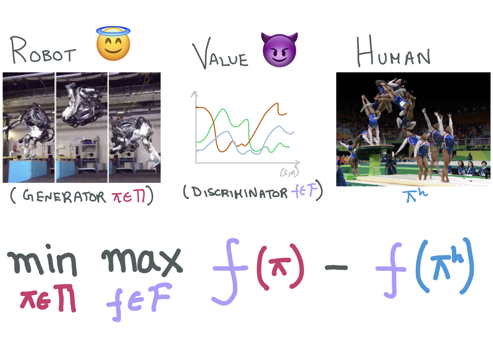 

        </td>  
        <td style="padding:20px;width:75%;vertical-align:middle">
          <a href="https://gokul.dev/mmil/" target="_blank"><strong>Of Moments and Matching: Trade-offs and Treatments in Imitation Learning</strong></a>
           
          Gokul Swamy, Sanjiban Choudhury, Zhiwei Steven Wu, and J Andrew Bagnell
           
          <em>International Conference on Machine Learning (ICML)</em>, 2021
           
          <a href="https://arxiv.org/abs/2103.03236" target="_blank">paper</a> /
          <a href="https://gokul.dev/mmil/" target="_blank">website</a> / 
          

          
All of imitation learning can be reduced to a game between a learner (generator) and a value function (discriminator) where the payoff is the performance difference between learner and expert. 

        </td>
      </tr>
          <tr>
        <td style="text-align: right;">
             
            
 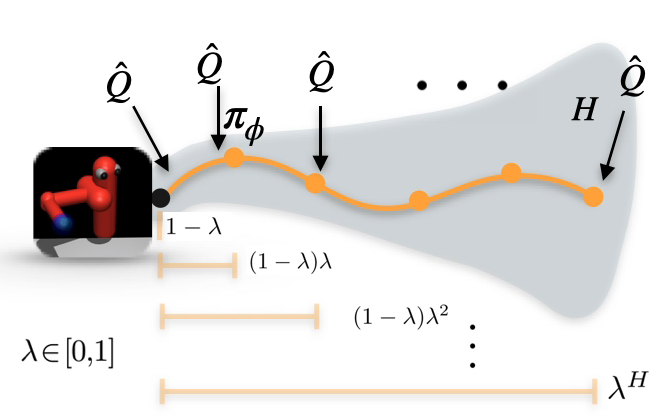 

        </td>  
        <td style="padding:20px;width:75%;vertical-align:middle">
          <a href="https://arxiv.org/abs/2012.05909" target="_blank"><strong>Blending MPC & Value Function Approximation for Efficient Reinforcement Learning</strong></a>
           
          Mohak Bhardwaj, Sanjiban Choudhury, and Byron Boots
           
          <em>International Conference on Learning Representations (ICLR)</em>, 2021
           
          <a href="https://arxiv.org/abs/2012.05909" target="_blank">paper</a> 
          

          
Blend model predictive control (MPC) with learned value estimates to trade-off MPC model errors with learner approximation errors. 

        </td>
      </tr>
    <tr>
        <td style="text-align: right;">
             
            
 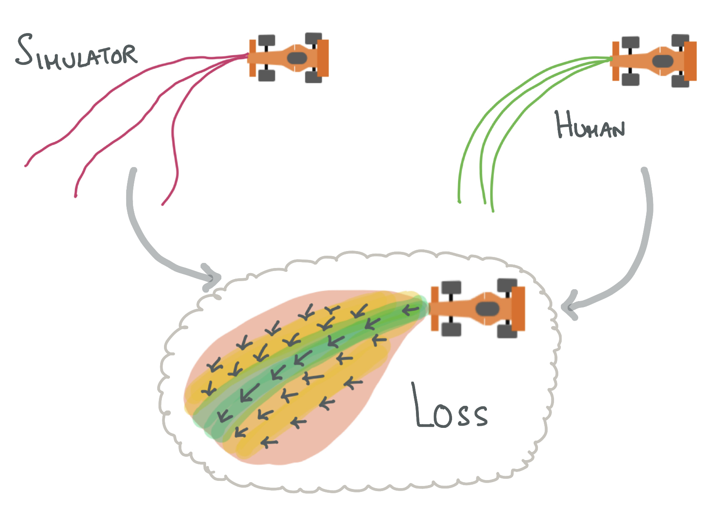 

        </td>  
        <td style="padding:20px;width:75%;vertical-align:middle">
          <a href="https://arxiv.org/abs/2102.02872" target="_blank"><strong>Feedback in Imitation Learning: The Three Regimes of Covariate Shift</strong></a>
           
          Jonathan Spencer, Sanjiban Choudhury, Arun Venkatraman, Brian Ziebart, and J Andrew Bagnell 
           
          <em>arXiv preprint arXiv:2102.02872</em>, 2021
           
          <a href="https://arxiv.org/abs/2102.02872" target="_blank">paper</a> /
          <a href="https://www.youtube.com/watch?v=4VAwdCIBTG8&feature=youtu.be" target="_blank">talk</a>
          

          
Not all imitation learning problems are alike -- some are easy (do behavior cloning), some are hard (call interactive expert), and some are just right (just need a simulator). 

        </td>
      </tr>
      <tr>
        <td style="text-align: right;">
             
            
 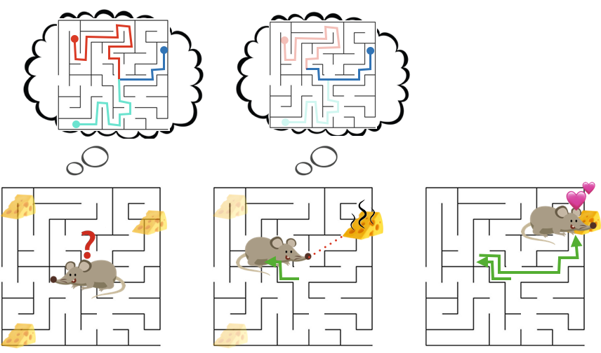 

        </td>  
        <td style="padding:20px;width:75%;vertical-align:middle">
          <a href="https://arxiv.org/abs/2002.03042" target="_blank"><strong> Bayesian Residual Policy Optimization: Scalable Bayesian Reinforcement Learning with Clairvoyant Experts</strong></a>
           
          Gilwoo Lee, Brian Hou, Sanjiban Choudhury and Siddhartha S. Srinivasa
           
          <em>IEEE/RSJ International Conference on Intelligent Robots and Systems (IROS)</em>, 2021
           
          <a href="https://arxiv.org/abs/2002.03042" target="_blank">paper</a> / 
          <a href="https://www.youtube.com/watch?v=-AqMvXtW37Y" target="_blank">talk</a>
          

          
 
          	In Bayesian RL, while solving the belief MDP is hard, solving individual latent MDP is easy. Combine value functions from each MDP along with a learned residual belief policy.    
          

        </td>
      </tr>
      <tr>
        <td style="text-align: right;">
             
            
  

        </td>  
        <td style="padding:20px;width:75%;vertical-align:middle">
          <a href="https://arxiv.org/abs/1905.12888" target="_blank"><strong>Imitation Learning as f-Divergence Minimization</strong></a>
           
          Liyiming Ke, Sanjiban Choudhury, Matt Barnes, Wen Sun, Gilwoo Lee and Siddhartha Srinivasa
           
          <em>Workshop on the Algorithmic Foundations of Robotics (WAFR)</em>, 2020
           
          <a href="https://arxiv.org/abs/1905.12888" target="_blank">paper</a>
          

          
 Many old (and new!) imitation learning algorithms are simply minimizing various <i>f</i>-divergences estimates between the expert and the learner trajectory distributions. 

        </td>
      </tr>
      <tr>
        <td style="text-align: right;">
             
            
 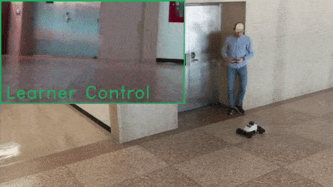 

        </td>  
        <td style="padding:20px;width:75%;vertical-align:middle">
          <a href="http://www.roboticsproceedings.org/rss16/p055.pdf" target="_blank"><strong>Learning from Interventions: Human-robot interaction as both explicit and implicit feedback</strong></a>
           
          Jonathan Spencer, Sanjiban Choudhury, Matt Barnes and Siddhartha Srinivasa 
           
          <em>Robotics: Science and Systems (RSS)</em>, 2020
           
          <a href="http://www.roboticsproceedings.org/rss16/p055.pdf" target="_blank">paper</a> /
          <a href="https://www.youtube.com/watch?v=NjkcgB-yy0w" target="_blank">talk</a> 
          

          
 How can we learn from human interventions? Every intervention reveals some information about expert's implicit value function. Infer this function and optimize it. 

        </td>
      </tr>
      <tr>
        <td style="text-align: right;">
             
            
 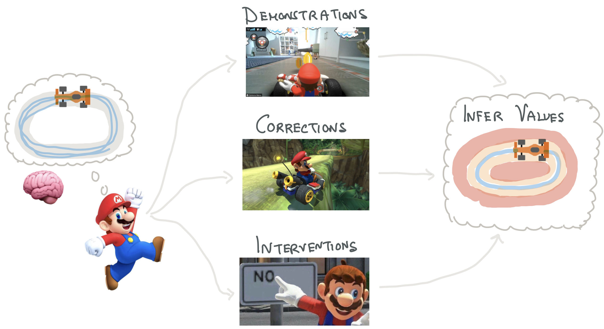 

        </td>  
        <td style="padding:20px;width:75%;vertical-align:middle">
          <a href="https://arxiv.org/abs/2104.01021" target="_blank"><strong>Learning Online from Corrective Feedback: A Meta-Algorithm for Robotics</strong></a>
           
          Matthew Schmittle, Sanjiban Choudhury, and Siddhartha Srinivasa 
           
          <em>arXiv preprint arXiv:2104.01021</em>, 2020
           
          <a href="https://arxiv.org/abs/2104.01021" target="_blank">paper</a> 
          

          
 We can model multi-modal feedback from human (demonstrations, interventions, verbal) as a stream of losses that can be minimized using any no-regret online learning algorithm. 

        </td>
      </tr>
