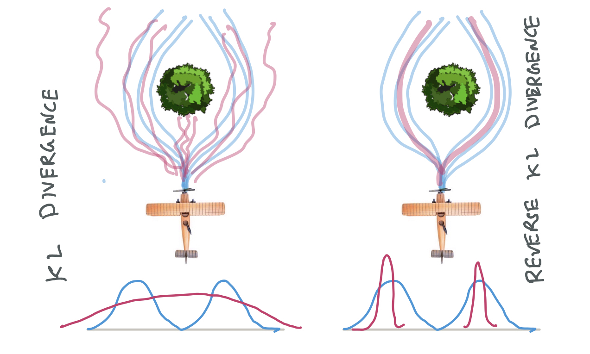

<!-- 

  

   -->

### Foundations
Our research is grounded in the fundamentals of artificial intelligence, focusing on the key question of <a href="https://www.youtube.com/watch?v=V38omEpfbjI&list=PLQZQ7N26C6ba2BDFVULmmBYC80cX6pNjZ&index=1" target="_blank">imitation learning</a> --- <em>How can an agent learn new behaviors by observing and interacting with a teacher?</em> 

Imitation learning offers a simple yet scalable way to **implicitly program agents** through demonstrations, interventions, or preferences. This has widespread impacts across various disciplines ranging from <a href="https://www.youtube.com/watch?v=QYsRzu7b_iQ&feature=youtu.be" target="_blank">teaching your home robot</a> to make you a bowl of soup, to <a href="https://openai.com/research/instruction-following" target="_blank">aligning large language models</a> from human preferences, to teaching self-driving cars to <a href="https://youtu.be/99kN1SVqjjA" target="_blank">drive more like humans</a>.

We explore a diverse array of questions in our research:
* **Efficient Inverse Reinforcement Learning**: How can we design algorithms that are exponentially more efficient than reinforcement learning? 
* **Vision-Language Demonstrations** How can we learn complex, long-horizon tasks from vision and language demonstrations?
* **Suboptimal experts** How do we learn from noisy, suboptimal experts? 
* **Human-Robot Teaming Behaviors** How can we learn effective human-robot collaboration from human-human teams?

... and much more! Checkout some of our <a href="" target="_blank">projects</a>.

### Applications

We test our ideas across a broad range of applications: 

1. **Everyday Robots:** Our primary focus is building home robots that interact with everyday users to learn personalized tasks like collaborative cooking, cleaning and assembly.

2. **Collaborative Games:** Games are a fun way to learn how humans collaborate, and there's lots of data! Through games, we explore new algorithms and architectures for effective human-robot collaboration.

3. **Self-Driving:** With industry partners Aurora, we develop ML models that enable safe, human-like driving. 

### Projects

<table>
    <tr>
        <!-- <td style="text-align: right;">
             
            
  

        </td>   -->
        <td style="text-align: right;">
        
 
             
        

        <!-- New Image Tag Below -->
        

            
        

        </td> 
        <td style="padding:20px;width:75%;vertical-align:middle">
          <strong>MOSAIC: A Modular System for Assistive and Interactive Cooking</strong>
           
          Yuki Wang, Kushal Kedia, Juntao Ren, Rahma Abdullah, Atiksh Bhardwaj, Angela Chao, Kelly Y Chen, Nathaniel Chin, Prithwish Dan, Xinyi Fan, Gonzalo Gonzalez-Pumariega, Aditya Kompella, Maximus Adrian Pace, Yash Sharma, Xiangwan Sun, Neha Sunkara, Sanjiban Choudhury
           
          <!-- <em>Conference on Robot Learning (CoRL)</em>, 2023 -->
           
          <a href="https://arxiv.org/abs/2402.18796" target="_blank">paper</a> /
          <a href="https://portal-cornell.github.io/MOSAIC/" target="_blank">website</a> 
          

          

          MOSAIC combines large pre-trained models for general tasks with task-specific modules to enable collaborative cooking.
          

        </td>
      </tr>
    <tr>
    <tr>
        <td style="text-align: right;">
             
            
  

        </td>  
        <td style="padding:20px;width:75%;vertical-align:middle">
          <strong>Hybrid Inverse Reinforcement Learning</strong>
           
          Juntao Ren, Gokul Swamy, Zhiwei Steven Wu, J. Andrew Bagnell, Sanjiban Choudhury
           
          <!-- <em>International Conference on Robotics and Automation (ICRA)</em>, 2024 -->
           
          <a href="https://arxiv.org/pdf/2402.08848.pdf" target="_blank">paper</a> 
          <!-- <a href="https://portal-cornell.github.io/interact/" target="_blank">website</a>  -->
          

          

          Hybrid IRL trains policies on a mixture of online and expert data to mitigate exploration.  
          

        </td>
      </tr>
    <tr>
    <tr>
        <td style="text-align: right;">
             
            
  

        </td>  
        <td style="padding:20px;width:75%;vertical-align:middle">
          <strong>InteRACT: Transformer Models for Human Intent Prediction Conditioned on Robot Actions</strong>
           
          Kushal Kedia, Atiksh Bhardwaj, Prithwish Dan, Sanjiban Choudhury
           
          <em>International Conference on Robotics and Automation (ICRA)</em>, 2024
           
          <a href="https://arxiv.org/pdf/2311.12943.pdf" target="_blank">paper</a> /
          <a href="https://portal-cornell.github.io/interact/" target="_blank">website</a> 
          

          

          Interact, predicts human intent conditioned on future robot actions for collaborative manipulation.  
          

        </td>
      </tr>
    <tr>
    <tr>
        <td style="text-align: right;">
             
            
  

        </td>  
        <td style="padding:20px;width:75%;vertical-align:middle">
          <strong>Demo2Code: From Summarizing Demonstrations to Synthesizing Code via Extended Chain-of-Thought</strong>
           
          Yuki Wang, Gonzalo Gonzalez-Pumariega, Yash Sharma, Sanjiban Choudhury
           
          <em>Advances in Neural Information Processing Systems (NeurIPS)</em>, 2023
           
          <a href="https://arxiv.org/abs/2305.16744" target="_blank">paper</a> /
          <a href="https://portal-cornell.github.io/demo2code/" target="_blank">website</a> 
          

          

          Demo2Code leverages LLMs to translate demonstrations to robot task code via an extended chain-of-thought that recursively summarizes demos to specification, and recursively expands specification to code.
          

        </td>
      </tr>
    <tr>
      <tr>
        <td style="text-align: right;">
             
            
  

        </td>  
        <td style="padding:20px;width:75%;vertical-align:middle">
          <strong>Learning Shared Safety Constraints from Multi-task Demonstrations</strong>
           
          Konwoo Kim, Gokul Swamy, Zuxin Liu, Ding Zhao, Sanjiban Choudhury, Steven Wu
           
          <em>Advances in Neural Information Processing Systems (NeurIPS)</em>, 2023
           
          <a href="https://arxiv.org/pdf/2309.00711.pdf" target="_blank">paper</a> /
          <a href="https://gokul.dev/icl/" target="_blank">website</a> 
          

          

          MT-ICL learns safety constraints from expert demonstrations across multiple tasks.
          

        </td>
      </tr>
    <tr>
    <tr>
        <td style="text-align: right;">
             
            
  

        </td>  
        <td style="padding:20px;width:75%;vertical-align:middle">
          <strong>ManiCast: Collaborative Manipulation with Cost-Aware Human Forecasting</strong>
           
          Kushal Kedia, Prithwish Dan, Atiksh Bhardwaj, Sanjiban Choudhury
           
          <em>Conference on Robot Learning (CoRL)</em>, 2023
           
          <a href="https://arxiv.org/pdf/2310.13258.pdf" target="_blank">paper</a> /
          <a href="https://portal-cornell.github.io/manicast/" target="_blank">website</a> 
          

          

          ManiCast learns forecasts of human motions and plans with such forecasts to solve collaborative manipulation tasks.  
          

        </td>
      </tr>
    <tr>
    <tr>
        <td style="text-align: right;">
             
            
  

        </td>  
        <td style="padding:20px;width:75%;vertical-align:middle">
          <strong>The Virtues of Laziness in Model-based RL: A Unified Objective and Algorithms</strong>
           
          Anirudh Vemula, Yuda Song, Aarti Singh, J. Andrew Bagnell, Sanjiban Choudhury
           
          <em>International Conference on Machine Learning (ICML)</em>, 2023
           
          <a href="https://proceedings.mlr.press/v202/vemula23a/vemula23a.pdf" target="_blank">paper</a>  
          

          
We propose a novel, lazy approach that addresses two fundamental challenges in Model-based Reinforcement Learning (MBRL): the computational expense of repeatedly finding a good policy in the learned model, and the objective mismatch between model fitting and policy computation. 

        </td>
      </tr>
    <tr>
    <tr>
        <td style="text-align: right;">
             
            
  

        </td>  
        <td style="padding:20px;width:75%;vertical-align:middle">
          <strong>Inverse Reinforcement Learning without Reinforcement Learning</strong>
           
          Gokul Swamy, Sanjiban Choudhury, J Andrew Bagnell, and Zhiwei Steven Wu
           
          <em>International Conference on Machine Learning (ICML)</em>, 2023
           
          <a href="https://proceedings.mlr.press/v202/swamy23a/swamy23a.pdf" target="_blank">paper</a> /
          <a href="https://gokul.dev/filter/" target="_blank">website</a> 
          

          
We explore inverse reinforcement learning and show that leveraging the state distribution of the expert can significantly reduce the complexities of the RL problem, theoretically providing an exponential speedup and practically enhancing performance in continuous control tasks. 

        </td>
      </tr>
    <tr>
      <tr>
        <td style="text-align: right;">
             
            
  

        </td>  
        <td style="padding:20px;width:75%;vertical-align:middle">
          <strong>A Game-Theoretic Framework for Joint Forecasting and Planning</strong>
           
          Kushal Kedia, Prithwish Dan, Sanjiban Choudhury
           
          <em>IEEE/RSJ International Conference on Intelligent Robots and Systems (IROS)</em>, 2023
           
          <a href="https://arxiv.org/pdf/2308.06137.pdf" target="_blank">paper</a> /
          <a href="https://portal-cornell.github.io/game-theoretic-forecasting-planning/" target="_blank">website</a> 
          

          

          We propose a novel game-theoretic framework for joint planning and forecasting with the payoff being the performance of the planner against the demonstrator, and present practical algorithms to train models in an end-to-end fashion.  
          

        </td>
      </tr>
    <tr>
  <tr>
        <td style="text-align: right;">
             
            
  

        </td>  
        <td style="padding:20px;width:75%;vertical-align:middle">
          <a href="https://arxiv.org/abs/2102.02872" target="_blank"><strong>Impossibly Good Experts and How to Follow Them</strong></a>
           
          Aaron Walsman, Muru Zhang, Sanjiban Choudhury, Dieter Fox, Ali Farhadi
           
          <em>International Conference on Learning Representations (ICLR)</em>, 2023
           
          <a href="https://openreview.net/pdf?id=sciA_xgYofB" target="_blank">paper</a>
          

          
We investigate sequential decision making with "Impossibly Good" experts possessing privileged information, propose necessary criteria for an optimal policy recovery within limited information, and introduce a novel approach, ELF Distillation, outperforming baselines in Minigrid and Vizdoom environments. 

        </td>
      </tr>
    <tr>
        <td style="text-align: right;">
             
            
  

        </td>  
        <td style="padding:20px;width:75%;vertical-align:middle">
          <strong>Sequence Model Imitation Learning with Unobserved Contexts</strong>
           
          Gokul Swamy, Sanjiban Choudhury, Zhiwei Steven Wu, and J Andrew Bagnell
           
          <em>Advances in Neural Information Processing Systems (NeurIPS)</em>, 2022
           
          <a href="https://arxiv.org/pdf/2208.02225.pdf" target="_blank">paper</a>  
          

          
We study imitation learning when the expert has privileged information and show that on-policy algorithms provably learn to recover from their initially suboptimal actions, while off-policy methods naively repeat the past action. 

        </td>
      </tr>
    <tr>
    <tr>
        <td style="text-align: right;">
             
            
  

        </td>  
        <td style="padding:20px;width:75%;vertical-align:middle">
          <strong>Minimax optimal online imitation learning via replay estimation</strong>
           
          Gokul Swamy, Nived Rajaraman, Matt Peng, Sanjiban Choudhury, J Bagnell, Steven Z Wu, Jiantao Jiao, Kannan Ramchandran
           
          <em>Advances in Neural Information Processing Systems (NeurIPS)</em>, 2022
           
          <a href="https://proceedings.neurips.cc/paper_files/paper/2022/file/2e809adc337594e0fee330a64acbb982-Paper-Conference.pdf" target="_blank">paper</a>  
          

          
 Imitation learning from noisy experts leads to biased policies! Replay estimation fixes this by smoothing the expert by repeatedly executing cached expert actions in a stochastic simulator and imitating that. 

        </td>
      </tr>
    <tr>
      <tr>
        <td style="text-align: right;">
             
            
  

        </td>  
        <td style="padding:20px;width:75%;vertical-align:middle">
          <strong>Towards Uniformly Superhuman Autonomy via Subdominance Minimization</strong>
           
          Brian Ziebart, Sanjiban Choudhury, Xinyan Yan, and Paul Vernaza
           
          <em>International Conference on Machine Learning (ICML)</em>, 2022
           
          <a href="https://proceedings.mlr.press/v162/ziebart22a/ziebart22a.pdf" target="_blank">paper</a>  
          

          
We look at imitation learning where the demonstrators have varying quality and seek to induce behavior that is unambiguously better (i.e., Pareto dominant or minimally subdominant) than all human demonstrations. 

        </td>
      </tr>
    <tr>
        <td style="text-align: right;">
             
            
  

        </td>  
        <td style="padding:20px;width:75%;vertical-align:middle">
          <a href="https://gokul.dev/mmil/" target="_blank"><strong>Of Moments and Matching: Trade-offs and Treatments in Imitation Learning</strong></a>
           
          Gokul Swamy, Sanjiban Choudhury, Zhiwei Steven Wu, and J Andrew Bagnell
           
          <em>International Conference on Machine Learning (ICML)</em>, 2021
           
          <a href="https://arxiv.org/abs/2103.03236" target="_blank">paper</a> /
          <a href="https://gokul.dev/mmil/" target="_blank">website</a> / 
          

          
All of imitation learning can be reduced to a game between a learner (generator) and a value function (discriminator) where the payoff is the performance difference between learner and expert. 

        </td>
      </tr>
          <tr>
        <td style="text-align: right;">
             
            
  

        </td>  
        <td style="padding:20px;width:75%;vertical-align:middle">
          <a href="https://arxiv.org/abs/2012.05909" target="_blank"><strong>Blending MPC & Value Function Approximation for Efficient Reinforcement Learning</strong></a>
           
          Mohak Bhardwaj, Sanjiban Choudhury, and Byron Boots
           
          <em>International Conference on Learning Representations (ICLR)</em>, 2021
           
          <a href="https://arxiv.org/abs/2012.05909" target="_blank">paper</a> 
          

          
Blend model predictive control (MPC) with learned value estimates to trade-off MPC model errors with learner approximation errors. 

        </td>
      </tr>
    <tr>
        <td style="text-align: right;">
             
            
  

        </td>  
        <td style="padding:20px;width:75%;vertical-align:middle">
          <a href="https://arxiv.org/abs/2102.02872" target="_blank"><strong>Feedback in Imitation Learning: The Three Regimes of Covariate Shift</strong></a>
           
          Jonathan Spencer, Sanjiban Choudhury, Arun Venkatraman, Brian Ziebart, and J Andrew Bagnell 
           
          <em>arXiv preprint arXiv:2102.02872</em>, 2021
           
          <a href="https://arxiv.org/abs/2102.02872" target="_blank">paper</a> /
          <a href="https://www.youtube.com/watch?v=4VAwdCIBTG8&feature=youtu.be" target="_blank">talk</a>
          

          
Not all imitation learning problems are alike -- some are easy (do behavior cloning), some are hard (call interactive expert), and some are just right (just need a simulator). 

        </td>
      </tr>
      <tr>
        <td style="text-align: right;">
             
            
  

        </td>  
        <td style="padding:20px;width:75%;vertical-align:middle">
          <a href="https://arxiv.org/abs/2002.03042" target="_blank"><strong> Bayesian Residual Policy Optimization: Scalable Bayesian Reinforcement Learning with Clairvoyant Experts</strong></a>
           
          Gilwoo Lee, Brian Hou, Sanjiban Choudhury and Siddhartha S. Srinivasa
           
          <em>IEEE/RSJ International Conference on Intelligent Robots and Systems (IROS)</em>, 2021
           
          <a href="https://arxiv.org/abs/2002.03042" target="_blank">paper</a> / 
          <a href="https://www.youtube.com/watch?v=-AqMvXtW37Y" target="_blank">talk</a>
          

          
 
          	In Bayesian RL, while solving the belief MDP is hard, solving individual latent MDP is easy. Combine value functions from each MDP along with a learned residual belief policy.    
          

        </td>
      </tr>
      <tr>
        <td style="text-align: right;">
             
            
  

        </td>  
        <td style="padding:20px;width:75%;vertical-align:middle">
          <a href="https://arxiv.org/abs/1905.12888" target="_blank"><strong>Imitation Learning as f-Divergence Minimization</strong></a>
           
          Liyiming Ke, Sanjiban Choudhury, Matt Barnes, Wen Sun, Gilwoo Lee and Siddhartha Srinivasa
           
          <em>Workshop on the Algorithmic Foundations of Robotics (WAFR)</em>, 2020
           
          <a href="https://arxiv.org/abs/1905.12888" target="_blank">paper</a>
          

          
 Many old (and new!) imitation learning algorithms are simply minimizing various <i>f</i>-divergences estimates between the expert and the learner trajectory distributions. 

        </td>
      </tr>
      <tr>
        <td style="text-align: right;">
             
            
  

        </td>  
        <td style="padding:20px;width:75%;vertical-align:middle">
          <a href="http://www.roboticsproceedings.org/rss16/p055.pdf" target="_blank"><strong>Learning from Interventions: Human-robot interaction as both explicit and implicit feedback</strong></a>
           
          Jonathan Spencer, Sanjiban Choudhury, Matt Barnes and Siddhartha Srinivasa 
           
          <em>Robotics: Science and Systems (RSS)</em>, 2020
           
          <a href="http://www.roboticsproceedings.org/rss16/p055.pdf" target="_blank">paper</a> /
          <a href="https://www.youtube.com/watch?v=NjkcgB-yy0w" target="_blank">talk</a> 
          

          
 How can we learn from human interventions? Every intervention reveals some information about expert's implicit value function. Infer this function and optimize it. 

        </td>
      </tr>
      <tr>
        <td style="text-align: right;">
             
            
  

        </td>  
        <td style="padding:20px;width:75%;vertical-align:middle">
          <a href="https://arxiv.org/abs/2104.01021" target="_blank"><strong>Learning Online from Corrective Feedback: A Meta-Algorithm for Robotics</strong></a>
           
          Matthew Schmittle, Sanjiban Choudhury, and Siddhartha Srinivasa 
           
          <em>arXiv preprint arXiv:2104.01021</em>, 2020
           
          <a href="https://arxiv.org/abs/2104.01021" target="_blank">paper</a> 
          

          
 We can model multi-modal feedback from human (demonstrations, interventions, verbal) as a stream of losses that can be minimized using any no-regret online learning algorithm. 

        </td>
      </tr>
