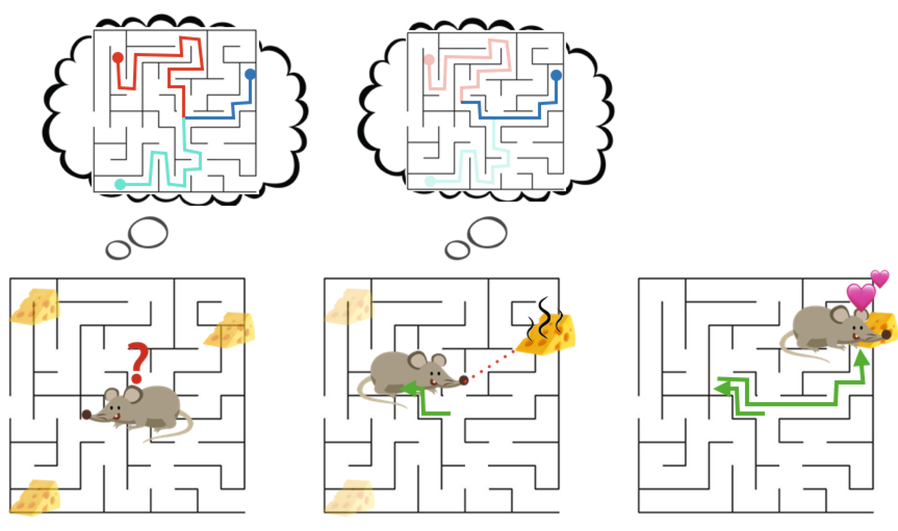

<!-- 

  

   -->

### Foundations
Our research is grounded in the fundamentals of artificial intelligence, focusing on the key question of <a href="https://www.youtube.com/watch?v=V38omEpfbjI&list=PLQZQ7N26C6ba2BDFVULmmBYC80cX6pNjZ&index=1" target="_blank">imitation learning</a> --- <em>How can an agent learn new behaviors by observing and interacting with a teacher?</em> 

Imitation learning offers a simple yet scalable way to **implicitly program agents** through demonstrations, interventions, or preferences. This has widespread impacts across various disciplines ranging from <a href="https://www.youtube.com/watch?v=QYsRzu7b_iQ&feature=youtu.be" target="_blank">teaching your home robot</a> to make you a bowl of soup, to <a href="https://openai.com/research/instruction-following" target="_blank">aligning large language models</a> from human preferences, to teaching self-driving cars to <a href="https://youtu.be/99kN1SVqjjA" target="_blank">drive more like humans</a>.

We explore a diverse array of questions in our research:
* **Efficient Inverse Reinforcement Learning**: How can we design algorithms that are exponentially more efficient than reinforcement learning? 
* **Vision-Language Demonstrations** How can we learn complex, long-horizon tasks from vision and language demonstrations?
* **Suboptimal experts** How do we learn from noisy, suboptimal experts? 
* **Human-Robot Teaming Behaviors** How can we learn effective human-robot collaboration from human-human teams?

... and much more! Checkout some of our <a href="" target="_blank">projects</a>.

### Applications

We test our ideas across a broad range of applications: 

1. **Everyday Robots:** Our primary focus is building home robots that interact with everyday users to learn personalized tasks like collaborative cooking, cleaning and assembly.

2. **Collaborative Games:** Games are a fun way to learn how humans collaborate, and there's lots of data! Through games, we explore new algorithms and architectures for effective human-robot collaboration.

3. **Self-Driving:** With industry partners Aurora, we develop ML models that enable safe, human-like driving. 

### Projects

<table>
    <tr>
        <td style="text-align: right;">
             
            
  

        </td>  
        <td style="padding:20px;width:75%;vertical-align:middle">
          <strong>Demo2Code: From Summarizing Demonstrations to Synthesizing Code via Extended Chain-of-Thought</strong>
           
          Yuki Wang, Gonzalo Gonzalez-Pumariega, Yash Sharma, Sanjiban Choudhury
           
          <em>Preprint </em>, 2023
           
          <a href="https://portal-cornell.github.io/demo2code-webpage/" target="_blank">website</a> /
          <a href="https://arxiv.org/abs/2305.16744" target="_blank">paper</a>  
          

          

          Demo2Code leverages LLMs to translate demonstrations to robot task code via an extended chain-of-thought that recursively summarizes demos to specification, and recursively expands specification to code.
          

        </td>
      </tr>
    <tr>
    <tr>
        <td style="text-align: right;">
             
            
  

        </td>  
        <td style="padding:20px;width:75%;vertical-align:middle">
          <strong>The Virtues of Laziness in Model-based RL: A Unified Objective and Algorithms</strong>
           
          Anirudh Vemula, Yuda Song, Aarti Singh, J. Andrew Bagnell, Sanjiban Choudhury
           
          <em>International Conference on Machine Learning (ICML)</em>, 2023
           
          <a href="https://proceedings.mlr.press/v202/vemula23a/vemula23a.pdf" target="_blank">paper</a>  
          

          
We propose a novel, lazy approach that addresses two fundamental challenges in Model-based Reinforcement Learning (MBRL): the computational expense of repeatedly finding a good policy in the learned model, and the objective mismatch between model fitting and policy computation. 

        </td>
      </tr>
    <tr>
    <tr>
        <td style="text-align: right;">
             
            
  

        </td>  
        <td style="padding:20px;width:75%;vertical-align:middle">
          <strong>Inverse Reinforcement Learning without Reinforcement Learning</strong>
           
          Gokul Swamy, Sanjiban Choudhury, J Andrew Bagnell, and Zhiwei Steven Wu
           
          <em>International Conference on Machine Learning (ICML)</em>, 2023
           
          <a href="https://gokul.dev/filter/" target="_blank">website</a> / 
          <a href="https://proceedings.mlr.press/v202/swamy23a/swamy23a.pdf" target="_blank">paper</a>
          

          
We explore inverse reinforcement learning and show that leveraging the state distribution of the expert can significantly reduce the complexities of the RL problem, theoretically providing an exponential speedup and practically enhancing performance in continuous control tasks. 

        </td>
      </tr>
    <tr>
  <tr>
        <td style="text-align: right;">
             
            
  

        </td>  
        <td style="padding:20px;width:75%;vertical-align:middle">
          <a href="https://arxiv.org/abs/2102.02872" target="_blank"><strong>Impossibly Good Experts and How to Follow Them</strong></a>
           
          Aaron Walsman, Muru Zhang, Sanjiban Choudhury, Dieter Fox, Ali Farhadi
           
          <em>International Conference on Learning Representations (ICLR)</em>, 2023
           
          <a href="https://openreview.net/pdf?id=sciA_xgYofB" target="_blank">paper</a>
          

          
We investigate sequential decision making with "Impossibly Good" experts possessing privileged information, propose necessary criteria for an optimal policy recovery within limited information, and introduce a novel approach, ELF Distillation, outperforming baselines in Minigrid and Vizdoom environments. 

        </td>
      </tr>
    <tr>
        <td style="text-align: right;">
             
            
  

        </td>  
        <td style="padding:20px;width:75%;vertical-align:middle">
          <strong>Sequence Model Imitation Learning with Unobserved Contexts</strong>
           
          Gokul Swamy, Sanjiban Choudhury, Zhiwei Steven Wu, and J Andrew Bagnell
           
          <em>Advances in Neural Information Processing Systems (NeurIPS)</em>, 2022
           
          <a href="https://arxiv.org/pdf/2208.02225.pdf" target="_blank">paper</a>  
          

          
We study imitation learning when the expert has privileged information and show that on-policy algorithms provably learn to recover from their initially suboptimal actions, while off-policy methods naively repeat the past action. 

        </td>
      </tr>
    <tr>
    <tr>
        <td style="text-align: right;">
             
            
  

        </td>  
        <td style="padding:20px;width:75%;vertical-align:middle">
          <strong>Minimax optimal online imitation learning via replay estimation</strong>
           
          Gokul Swamy, Nived Rajaraman, Matt Peng, Sanjiban Choudhury, J Bagnell, Steven Z Wu, Jiantao Jiao, Kannan Ramchandran
           
          <em>Advances in Neural Information Processing Systems (NeurIPS)</em>, 2022
           
          <a href="https://proceedings.neurips.cc/paper_files/paper/2022/file/2e809adc337594e0fee330a64acbb982-Paper-Conference.pdf" target="_blank">paper</a>  
          

          
 Imitation learning from noisy experts leads to biased policies! Replay estimation fixes this by smoothing the expert by repeatedly executing cached expert actions in a stochastic simulator and imitating that. 

        </td>
      </tr>
    <tr>
      <tr>
        <td style="text-align: right;">
             
            
  

        </td>  
        <td style="padding:20px;width:75%;vertical-align:middle">
          <strong>Towards Uniformly Superhuman Autonomy via Subdominance Minimization</strong>
           
          Brian Ziebart, Sanjiban Choudhury, Xinyan Yan, and Paul Vernaza
           
          <em>International Conference on Machine Learning (ICML)</em>, 2022
           
          <a href="https://proceedings.mlr.press/v162/ziebart22a/ziebart22a.pdf" target="_blank">paper</a>  
          

          
We look at imitation learning where the demonstrators have varying quality and seek to induce behavior that is unambiguously better (i.e., Pareto dominant or minimally subdominant) than all human demonstrations. 

        </td>
      </tr>
    <tr>
        <td style="text-align: right;">
             
            
  

        </td>  
        <td style="padding:20px;width:75%;vertical-align:middle">
          <a href="https://gokul.dev/mmil/" target="_blank"><strong>Of Moments and Matching: Trade-offs and Treatments in Imitation Learning</strong></a>
           
          Gokul Swamy, Sanjiban Choudhury, Zhiwei Steven Wu, and J Andrew Bagnell
           
          <em>International Conference on Machine Learning (ICML)</em>, 2021
           
          <a href="https://gokul.dev/mmil/" target="_blank">project page</a> / 
          <a href="https://arxiv.org/abs/2103.03236" target="_blank">paper</a> /
          <a href="https://www.youtube.com/playlist?list=PL51kEpt5uSsbZSaGyUMsLsOoFP8-hyx0R" target="_blank">video</a> /
          <a href="https://github.com/gkswamy98/pillbox" target="_blank">code</a> 
          

          
All of imitation learning can be reduced to a game between a learner (generator) and a value function (discriminator) where the payoff is the performance difference between learner and expert. 

        </td>
      </tr>
          <tr>
        <td style="text-align: right;">
             
            
  

        </td>  
        <td style="padding:20px;width:75%;vertical-align:middle">
          <a href="https://arxiv.org/abs/2012.05909" target="_blank"><strong>Blending MPC & Value Function Approximation for Efficient Reinforcement Learning</strong></a>
           
          Mohak Bhardwaj, Sanjiban Choudhury, and Byron Boots
           
          <em>International Conference on Learning Representations (ICLR)</em>, 2021
           
          <a href="https://arxiv.org/abs/2012.05909" target="_blank">paper</a> 
          

          
Blend model predictive control (MPC) with learned value estimates to trade-off MPC model errors with learner approximation errors. 

        </td>
      </tr>
    <tr>
        <td style="text-align: right;">
             
            
  

        </td>  
        <td style="padding:20px;width:75%;vertical-align:middle">
          <a href="https://arxiv.org/abs/2102.02872" target="_blank"><strong>Feedback in Imitation Learning: The Three Regimes of Covariate Shift</strong></a>
           
          Jonathan Spencer, Sanjiban Choudhury, Arun Venkatraman, Brian Ziebart, and J Andrew Bagnell 
           
          <em>arXiv preprint arXiv:2102.02872</em>, 2021
           
          <a href="https://arxiv.org/abs/2102.02872" target="_blank">paper</a> /
          <a href="https://www.youtube.com/watch?v=4VAwdCIBTG8&feature=youtu.be" target="_blank">talk</a>
          

          
Not all imitation learning problems are alike -- some are easy (do behavior cloning), some are hard (call interactive expert), and some are just right (just need a simulator). 

        </td>
      </tr>
      <tr>
        <td style="text-align: right;">
             
            
  

        </td>  
        <td style="padding:20px;width:75%;vertical-align:middle">
          <a href="https://arxiv.org/abs/2002.03042" target="_blank"><strong> Bayesian Residual Policy Optimization: Scalable Bayesian Reinforcement Learning with Clairvoyant Experts</strong></a>
           
          Gilwoo Lee, Brian Hou, Sanjiban Choudhury and Siddhartha S. Srinivasa
           
          <em>IEEE/RSJ International Conference on Intelligent Robots and Systems (IROS)</em>, 2021
           
          <a href="https://arxiv.org/abs/2002.03042" target="_blank">paper</a> / 
          <a href="https://www.youtube.com/watch?v=-AqMvXtW37Y" target="_blank">talk</a>
          

          
 
          	In Bayesian RL, while solving the belief MDP is hard, solving individual latent MDP is easy. Combine value functions from each MDP along with a learned residual belief policy.    
          

        </td>
      </tr>
      <tr>
        <td style="text-align: right;">
             
            
  

        </td>  
        <td style="padding:20px;width:75%;vertical-align:middle">
          <a href="https://arxiv.org/abs/2104.05037" target="_blank"><strong>Guided Incremental Local Densification for Accelerated Sampling-based Motion Planning</strong></a>
           
          Aditya Mandalika, Rosario Scalise, Brian Hou, Sanjiban Choudhury, Siddhartha S. Srinivasa
           
          <em>IEEE International Conference on Robotics and Automation (ICRA)</em>, 2023
           
          <a href="https://arxiv.org/abs/2104.05037" target="_blank">paper</a> 
          

          
 Instead of sampling from an informed set ellipse (high recall, low precision), samples from sets of sub-ellipses (lower recall, higher precision). 

        </td>
      </tr>
      <tr>
        <td style="text-align: right;">
             
            
  

        </td>  
        <td style="padding:20px;width:75%;vertical-align:middle">
          <a href="https://arxiv.org/abs/1905.12888" target="_blank"><strong>Imitation Learning as f-Divergence Minimization</strong></a>
           
          Liyiming Ke, Sanjiban Choudhury, Matt Barnes, Wen Sun, Gilwoo Lee and Siddhartha Srinivasa
           
          <em>Workshop on the Algorithmic Foundations of Robotics (WAFR)</em>, 2020
           
          <a href="https://arxiv.org/abs/1905.12888" target="_blank">paper</a>
          

          
 Many old (and new!) imitation learning algorithms are simply minimizing various <i>f</i>-divergences estimates between the expert and the learner trajectory distributions. 

        </td>
      </tr>
      <tr>
        <td style="text-align: right;">
             
            
  

        </td>  
        <td style="padding:20px;width:75%;vertical-align:middle">
          <a href="http://www.roboticsproceedings.org/rss16/p055.pdf" target="_blank"><strong>Learning from Interventions: Human-robot interaction as both explicit and implicit feedback</strong></a>
           
          Jonathan Spencer, Sanjiban Choudhury, Matt Barnes and Siddhartha Srinivasa 
           
          <em>Robotics: Science and Systems (RSS)</em>, 2020
           
          <a href="http://www.roboticsproceedings.org/rss16/p055.pdf" target="_blank">paper</a> /
          <a href="https://www.youtube.com/watch?v=NjkcgB-yy0w" target="_blank">talk</a> 
          

          
 How can we learn from human interventions? Every intervention reveals some information about expert's implicit value function. Infer this function and optimize it. 

        </td>
      </tr>
      <tr>
        <td style="text-align: right;">
             
            
  

        </td>  
        <td style="padding:20px;width:75%;vertical-align:middle">
          <a href="https://arxiv.org/abs/2104.01021" target="_blank"><strong>Learning Online from Corrective Feedback: A Meta-Algorithm for Robotics</strong></a>
           
          Matthew Schmittle, Sanjiban Choudhury, and Siddhartha Srinivasa 
           
          <em>arXiv preprint arXiv:2104.01021</em>, 2020
           
          <a href="https://arxiv.org/abs/2104.01021" target="_blank">paper</a> 
          

          
 We can model multi-modal feedback from human (demonstrations, interventions, verbal) as a stream of losses that can be minimized using any no-regret online learning algorithm. 

        </td>
      </tr>
      <tr>
        <td style="text-align: right;">
             
            
  

        </td>  
        <td style="padding:20px;width:75%;vertical-align:middle">
          <a href="https://www.spiedigitallibrary.org/conference-proceedings-of-spie/11413/2559995/Toward-fieldable-human-scale-mobile-manipulation-using-RoMan/10.1117/12.2559995.short" target="_blank"><strong>Toward fieldable human-scale mobile manipulation using RoMan</strong></a>
           
          
          C. Kessens, J. Fink, A. Hurwitz, M. Kaplan, P. R. Osteen, T. Rocks, J. Rogers, E. Stump, L. Quang, M. DiBlasi, M. Gonzalez, D. Patel, J. Patel, S. Patel, M. Weiker, J. Bowkett, R. Detry, S. Karumanchi, J. Burdick, L. Matthies, Y. Oza, A. Agarwal, A. Dornbush, M. Likhachev, K. Schmeckpeper, K. Daniilidis, A. Kamat, <strong>S. Choudhury</strong>, A. Mandalika, S. Srinivasa 
           
          <em>Artificial Intelligence and Machine Learning for Multi-Domain Operations Applications II</em>, 2020
           
          <a href="https://www.spiedigitallibrary.org/conference-proceedings-of-spie/11413/2559995/Toward-fieldable-human-scale-mobile-manipulation-using-RoMan/10.1117/12.2559995.short" target="_blank">paper</a> 
          

          
 A full-stack mobile manipulator that autonomously navigates and manipulates objects in the wild.
          

        </td>
      </tr>
      <tr>
        <td style="text-align: right;">
             
            
  

        </td>  
        <td style="padding:20px;width:75%;vertical-align:middle">
          <a href="https://arxiv.org/abs/2002.11853" target="_blank"><strong>Posterior Sampling for Anytime Motion Planning on Graphs with Expensive-to-Evaluate Edges</strong></a>
           
          Brian Hou, Sanjiban Choudhury, Gilwoo Lee, Aditya Mandalika, and Siddhartha Srinivasa
           
          <em>IEEE International Conference on Robotics and Automation (ICRA)</em>, 2020
           
          <a href="https://arxiv.org/abs/2002.11853" target="_blank">paper</a> /
          <a href="https://www.youtube.com/watch?v=1DYZ_mseL3c" target="_blank">video</a>
          

          
 Anytime motion planning can be viewed through a Bayesian lens where we are initially uncertain about the shortest path, and must probe the environment to progressively yield shorter and shorter paths.
          

        </td>
      </tr>
            <tr>
        <td style="text-align: right;">
             
            
  

        </td>  
        <td style="padding:20px;width:75%;vertical-align:middle">
          <a href="https://arxiv.org/abs/2002.11853" target="_blank"><strong>Generalized Lazy Search for Robot Motion Planning: Interleaving Search and Edge Evaluation via Event-based Toggles</strong></a>
           
          Aditya Mandalika, Sanjiban Choudhury, Oren Salzman and Siddhartha Srinivasa
           
          <em>International Conference on Automated Planning and Scheduling (ICAPS)</em>, 2019
           
          <b>
               Best Student Paper Award
          </b>  
          <a href="../publications/docs/conferences/mandalika_icaps2019.pdf" target="_blank">paper</a> /
          <a href="https://arxiv.org/abs/1904.02795" target="_blank">long paper</a>
          

          
 Unified framework for interleaving search and edge evaluation to provably minimize total planning time. 
          

        </td>
      </tr>
        <tr>
        <td style="text-align: right;">
             
            
  

        </td>  
        <td style="padding:20px;width:75%;vertical-align:middle">
          <a href="../publications/docs/conferences/saund_isrr2019.pdf" target="_blank"><strong>The Blindfolded Robot : A Bayesian Approach to Planning with Contact Feedback</strong></a>
           
          Brad Saund, Sanjiban Choudhury, Siddhartha Srinivasa, and Dmitry Berenson. 
           
          <em>International Symposium on Robotics Research (ISRR)</em>, 2019
           
          <a href="../publications/docs/conferences/saund_isrr2019.pdf" target="_blank">paper</a> /
          <a href="https://www.youtube.com/watch?v=DlNhtBnF6ro" target="_blank">video</a>
          

          
 
          	Casts manipulation under occlusion as a search on a graph where feasibility of an edge is only revealed when an agent attempts to traverse it. Use Bayesian prior to explore exploit.
          

        </td>
      </tr>
      <tr>
        <td style="text-align: right;">
             
            
  

        </td>  
        <td style="padding:20px;width:75%;vertical-align:middle">
          <a href="https://arxiv.org/abs/1907.07238" target="_blank"><strong> Leveraging Experience in Lazy Search</strong></a>
           
          Mohak Bhardwaj, Sanjiban Choudhury, Byron Boots and Siddhartha Srinivasa
           
          <em>Robotics: Science and Systems (RSS)</em>, 2019
           
          <a href="https://arxiv.org/abs/1907.07238" target="_blank">paper</a>
          

          
 
          	The laziest search is one that checks the minimal number of edges to eliminate all potential shortest paths. We use imitation learning to imitate such oracles to learn truly lazy planners.
          

        </td>
      </tr>
      <tr>
        <td style="text-align: right;">
             
            
  

        </td>  
        <td style="padding:20px;width:75%;vertical-align:middle">
          <a href="https://arxiv.org/abs/1907.09574" target="_blank"><strong> LEGO: Leveraging Experience in Roadmap Generation for Sampling-Based Planning</strong></a>
           
          Rahul Kumar, Aditya Mandalika, Sanjiban Choudhury and Siddhartha S. Srinivasa
           
          <em>IEEE/RSJ International Conference on Intelligent Robots and Systems (IROS)</em>, 2019
           
          <a href="https://arxiv.org/abs/1907.09574" target="_blank">paper</a>
          

          
 
          	Learn a sampling distribution that creates graphs that are sparse (for speedy search) but with nodes carefully placed at bottleneck regions (to cover optimal paths).
          

        </td>
      </tr>
      <tr>
        <td style="text-align: right;">
             
            
  

        </td>  
        <td style="padding:20px;width:75%;vertical-align:middle">
          <a href="https://arxiv.org/abs/1810.01014" target="_blank"><strong> Bayesian Policy Optimization for Model Uncertainty</strong></a>
           
          Gilwoo Lee, Brian Hou, Aditya Mandalika Vamsikrishna, Jeongseok Lee, Sanjiban Choudhury, Siddhartha S. Srinivasa
           
          <em>International Conference on Learning Representations (ICLR)</em>, 2019
           
          <a href="https://arxiv.org/abs/1810.01014" target="_blank">paper</a>
          

          
 
          	Learn a policy that directly maps state and belief over MDPs to action. Leverages the fact that belief can be compressed significantly. 
          

        </td>
      </tr>
      <tr>
        <td style="text-align: right;">
             
            
  

        </td>  
        <td style="padding:20px;width:75%;vertical-align:middle">
          <a href="https://arxiv.org/abs/1810.03048" target="_blank"><strong> Bayes-CPACE: PAC Optimal Exploration in Continuous Space Bayes-Adaptive Markov Decision Processes </strong></a>
           
          Gilwoo Lee, Sanjiban Choudhury, Brian Hou, and Siddhartha Srinivasa
           
          <em>arXiv preprint arXiv:1810.03048</em>, 2018
           
          <a href="https://arxiv.org/abs/1810.03048" target="_blank">paper</a>
          

          
 
          	Computes a near-optimal value function by covering the continuous state-belief-action space with a finite set of representative samples and exploiting the Lipschitz continuity of the value function 
          

        </td>
      </tr>
      <tr>
        <td style="text-align: right;">
             
            
  

        </td>  
        <td style="padding:20px;width:75%;vertical-align:middle">
          <a href="https://arxiv.org/abs/1910.06988" target="_blank"><strong> Autonomous Aerial Cinematography In Unstructured Environments With Learned Artistic Decision-Making </strong></a>
           
          Rogerio Bonatti, Wenshan Wang, Cherie Ho, Aayush Ahuja, Mirko Gschwindt, Efe Camci, Erdal Kayacan, Sanjiban Choudhury and Sebastian Scherer 
           
          <em>Journal of Field Robotics (JFR)</em>, 2019
           
          <a href="https://arxiv.org/abs/1910.06988" target="_blank">JFR</a> / 
          <a href="https://arxiv.org/abs/1904.02319" target="_blank">IROS'19</a> / 
          <a href="https://arxiv.org/abs/1808.09563" target="_blank">ISER'19</a> / 
          <a href="https://www.youtube.com/watch?v=QX73nBBwd28&feature=youtu.be" target="_blank">video 1</a> /
          <a href="https://www.youtube.com/watch?v=ZE9MnCVmumc&feature=youtu.be" target="_blank">video 2</a> /
          <a href="https://www.youtube.com/watch?v=ookhHnqmlaU&feature=youtu.be" target="_blank">video 3</a>
          

          
 
          	 A selfie drone that can film a target moving in a cluttered environment with almost no prior information. 
          

        </td>
      </tr>
      <tr>
        <td style="text-align: right;">
             
            
  

        </td>  
        <td style="padding:20px;width:75%;vertical-align:middle">
          <a href="https://arxiv.org/abs/1711.07329" target="_blank"><strong> Bayesian Active Edge Evaluation </strong></a>
           
          Sanjiban Choudhury, Siddhartha Srinivasa and Sebastian Scherer
           
          <em>International Joint Conferences on Artificial Intelligence (IJCAI)</em>, 2018
           
          <a href="https://arxiv.org/abs/1711.07329" target="_blank">paper</a> / 
          <a href="../publications/docs/conferences/sanjibac_isrr2017.pdf" target="_blank">blue sky</a>
          

          
 
          	 Given a prior over possible worlds, learn a decision tree to near-optimally collpase uncertainty to compute a feasible path.
          

        </td>
      </tr>
      <tr>
        <td style="text-align: right;">
             
            
  

        </td>  
        <td style="padding:20px;width:75%;vertical-align:middle">
          <a href="https://arxiv.org/abs/1706.09351" target="_blank"><strong> Near-Optimal Edge Evaluation in Explicit Generalized
                    Binomial Graphs </strong></a>
           
          Sanjiban Choudhury, Shervin Javdani, Siddhartha Srinivasa and Sebastian Scherer
           
          <em>Neural Information Processing Systems (NeurIPS)</em>, 2017
           
          <a href="https://arxiv.org/abs/1706.09351" target="_blank">paper</a> /
          <a href="https://www.youtube.com/watch?v=HSKRuuXUvs4&t=96s" target="_blank">talk</a>
          

          
 
          	 Given a graph with N edges that could independently be 0/1, and a prior belief, check an optimal number of edges till you find a feasible path. 
          

        </td>
      </tr>
      <tr>
        <td style="text-align: right;">
             
            
  

        </td>  
        <td style="padding:20px;width:75%;vertical-align:middle">
          <a href="https://arxiv.org/abs/1711.06391" target="_blank"><strong> Data-driven Planning via Imitation Learning </strong></a>
           
          Sanjiban Choudhury, Mohak Bhardwaj, Sankalp Arora, Ashish Kapoor, Gireeja Ranade, Sebastian Scherer, Debadeepta Dey
           
          <em>The International Journal of Robotics Research (IJRR)</em>, 2018
           
          <b>
            Finalist for Best Paper of the Year
          </b>  
          <a href="https://arxiv.org/abs/1711.06391" target="_blank">paper</a>
          

          
 Train planners (that operate on partial information) to imitate clairvoyant planners (that have full information) to choose optimal planning decisions. (applies to heuristic search, exploration planning, etc)
          

        </td>
      </tr>
      <tr>
        <td style="text-align: right;">
             
            
  

        </td>  
        <td style="padding:20px;width:75%;vertical-align:middle">
          <a href="https://arxiv.org/abs/1707.03034" target="_blank"><strong> Learning Heuristic Search via Imitation </strong></a>
           
          Mohak Bhardwaj, Sanjiban Choudhury, Sebastian Scherer
           
          <em>Conference on Robot Learning (CoRL)</em>, 2017, Oral (8%)
           
          <a href="https://arxiv.org/abs/1707.03034" target="_blank">paper</a> / 
          <a href="https://www.youtube.com/watch?v=OFmWo36N98U" target="_blank">video</a> 
          

          
 Search algorithms use heuristics to balance <i>exploration</i>, i.e., discovering promising new states, and <i>exploitation</i>, i.e., expanding the current best state. Learn heuristics by imitating optimal planners. 
          

        </td>
      </tr>
      <tr>
        <td style="text-align: right;">
             
            
  

        </td>  
        <td style="padding:20px;width:75%;vertical-align:middle">
          <a href="https://arxiv.org/abs/1705.07834" target="_blank"><strong> Adaptive Information Gathering via Imitation Learning </strong></a>
           
          Sanjiban Choudhury, Ashish Kapoor, Gireeja Ranade, Sebastian Scherer, Debadeepta Dey
           
          <em>Robotics Science and Systems (RSS)</em>, 2017
           
          <a href="https://arxiv.org/abs/1705.07834" target="_blank">paper</a> 
          

          
 
          	POMDPs are hard. But MDPs are relatively easy. Train POMDP policies by imitating MPD oracles to get good, and sometimes near-optimal, POMDP policies.
          

        </td>
      </tr>
       <tr>
        <td style="text-align: right;">
             
            
  

        </td>  
        <td style="padding:20px;width:75%;vertical-align:middle">
          <a href="https://arxiv.org/abs/1611.04180" target="_blank"><strong> Learning to Gather Information via Imitation </strong></a>
           
          Sanjiban Choudhury, Ashish Kapoor, Gireeja Ranade, Debadeepta Dey
           
          <em>IEEE International Conference on Robotics and Automation (ICRA)</em>, 2017
           
          <a href="https://arxiv.org/abs/1611.04180" target="_blank">paper</a> 
          

          
 
          	How efficiently a robot can map a new area depends on the geometry of the world. We show how learning can be leveraged to design more efficient information gathering policies. 
          

        </td>
      </tr>
      <tr>
        <td style="text-align: right;">
             
            
  

        </td>  
        <td style="padding:20px;width:75%;vertical-align:middle">
          <a href="https://arxiv.org/abs/1611.00111" target="_blank"><strong> Densification Strategies for Anytime Motion Planning over Large Dense Roadmaps </strong></a>
           
           Shushman Choudhury, Oren Salzman, Sanjiban Choudhury, Siddhartha Srinivasa
           
          <em>IEEE International Conference on Robotics and Automation (ICRA)</em>, 2017
           
          <a href="https://arxiv.org/abs/1611.00111" target="_blank">paper</a> 
          <a href="https://arxiv.org/abs/1711.04040" target="_blank">long paper</a>
          

          
 
          	  Anytime motion planning by -- select a subgraph, search it, and use the results to select a better subgraph till the shortest path on the original dense graph is found. 
          

        </td>
      </tr>
      <tr>
        <td style="text-align: right;">
             
            
  

        </td>  
        <td style="padding:20px;width:75%;vertical-align:middle">
          <a href="../publications/docs/conferences/sanjibac_icra2016.pdf" target="_blank"><strong> Regionally Accelerated Batch Informed Trees (RABIT*): A Framework to Integrate Local Information into Optimal Path Planning </strong></a>
           
          Sanjiban Choudhury, Jonathan D. Gammell, Timothy D. Barfoot, Siddhartha Srinivasa, Sebastian Scherer
           
          <em>IEEE International Conference on Robotics and Automation (ICRA)</em>, 2016
           
          <a href="../publications/docs/conferences/sanjibac_icra2016.pdf" target="_blank">paper</a> 
          

          
 
  	        Interleave search and optimization by applying CHOMP to only a subset of promising edges in a BIT* search tree.
          

        </td>
      </tr>
      <tr>
        <td style="text-align: right;">
             
            
  

        </td>  
        <td style="padding:20px;width:75%;vertical-align:middle">
          <a href="../publications/docs/conferences/tallavajhula_icra2016.pdf" target="_blank"><strong> List Prediction Applied To Motion Planning</strong></a>
           
          Abhijeet Tallavajhula, Sanjiban Choudhury, Sebastian Scherer, Alonzo Kelly
           
          <em>IEEE International Conference on Robotics and Automation (ICRA)</em>, 2016
           
          <a href="../publications/docs/conferences/tallavajhula_icra2016.pdf" target="_blank">paper</a> 
          

          
 
          	Train a learner to produce a diverse set of planner options (initializations, heuristics, hyperparameters) that can be run in parallel such that at least one has good performance. 
          

        </td>
      </tr>
      <tr>
        <td style="text-align: right;">
             
            
  

        </td>  
        <td style="padding:20px;width:75%;vertical-align:middle">
          <a href="../publications/docs/conferences/sanjibac_rss2015.pdf" target="_blank"><strong> Theoretical Limits of Speed and Resolution for Kinodynamic
                    Planning in a Poisson
                    Forest</strong></a>
           
          Sanjiban Choudhury, Sebastian Scherer and J. Andrew Bagnell
           
          <em>Robotics Science and Systems (RSS)</em>, 2015
           
          <a href="../publications/docs/conferences/sanjibac_rss2015.pdf" target="_blank">paper</a> /
          <a href="../publications/docs/technical_reports/sanjibac_TR-05-04_2015.pdf" target="_blank">long paper</a>
          

          
 
        How fast can a drone fly in a forest even if it knew the location of every single tree?  
        We answer this question with the help of <i>percolation theory</i> on random graphs.  
          

        </td>
      </tr>
      <tr>
        <td style="text-align: right;">
             
            
  

        </td>  
        <td style="padding:20px;width:75%;vertical-align:middle">
          <a href="../publications/docs/conferences/sanjibac_ahs2014.pdf" target="_blank"><strong> The Planner Ensemble and Trajectory Executive: A High
                    Performance Motion
                    Planning System with Guaranteed Safety</strong></a>
           
              Sanjiban Choudhury, Sankalp Arora and Sebastian Scherer
           
          <em>American Helicopter Society (AHS) 70th Annual Forum</em>, 2014
           
          <b>
                    Best Paper Award
          </b>  
          <a href="../publications/docs/conferences/sanjibac_ahs2014.pdf" target="_blank">paper</a> / 
          <a href="../publications/docs/journals/choudhury_jfr2019.pdf" target="_blank">long paper</a> /
			<a href="https://youtu.be/xO-9rTYNViI" target="_blank">Clip 1</a> /
			<a href="https://youtu.be/i4rDt9Bwgps" target="_blank">Clip 2</a> /
			<a href="https://youtu.be/94zLYkhUgfA" target="_blank">Clip 3</a> /
			<a href="https://youtu.be/wmXYXluN0c8" target="_blank">Clip 4</a> /
			<a href="https://youtu.be/WlZrVWy87wE" target="_blank">Clip 5</a>
          

          
 
          	The first approach to planning safe, real-time trajectories for a full-scale, autonomous helicopter from takeoff to landing, with more than 700 flight test hours. 
          

        </td>
      </tr>
      <tr>
        <td style="text-align: right;">
             
            
  

        </td>  
        <td style="padding:20px;width:75%;vertical-align:middle">
          <a href="../publications/docs/conferences/sanjibac_ensemble_icra2015.pdf" target="_blank"><strong> The Planner Ensemble: Motion Planning by Executing Diverse
                    Algorithms </strong></a>
           
          Sanjiban Choudhury,  Sankalp Arora and Sebastian Scherer
           
          <em>IEEE International Conference on Robotics and Automation (ICRA) </em>, 2015
           
          <a href="../publications/docs/conferences/sanjibac_ensemble_icra2015.pdf" target="_blank">paper</a> 
          

          
 
          	Can a single planner solve all planning problems? Hedge our bets and predict an <i>ensemble</i> of diverse planners that can be run in parallel such that at least one solves the problem. 
          

        </td>
      </tr>
      <tr>
        <td style="text-align: right;">
             
            
  

        </td>  
        <td style="padding:20px;width:75%;vertical-align:middle">
          <a href="../publications/docs/conferences/sanjibac_dpf_icra2015.pdf" target="_blank"><strong> The Dynamics Projection Filter (DPF) – Real-Time Nonlinear
                    Trajectory Optimization Using Projection Operators </strong></a>
           
          Sanjiban Choudhury and Sebastian Scherer
           
          <em>IEEE International Conference on Robotics and Automation (ICRA) </em>, 2015
           
          <a href="../publications/docs/conferences/sanjibac_dpf_icra2015.pdf" target="_blank">paper</a> 
          

          
 
			A nonlinear projection operator as a control Lyapunov function that takes an optimized workspace trajectory and projects it to a configuration space trajectory with guarantees on sub-optimality.
          

        </td>
      </tr>
      <tr>
        <td style="text-align: right;">
             
            
  

        </td>  
        <td style="padding:20px;width:75%;vertical-align:middle">
          <a href="../publications/docs/journals/nuske_jfr2015.pdf" target="_blank"><strong> Autonomous Exploration and Motion Planning for an Unmanned Aerial Vehicle Navigating Rivers</strong></a>
           
          Stephen T. Nuske, Sanjiban Choudhury, Sezal Jain, Andrew D. Chambers, Luke Yoder, Sebastian Scherer, Lyle J. Chamberlain, Hugh Cover and Sanjiv Singh
           
          <em>Journal of Field Robotics (JFR)</em>, 2015
           
          <a href="../publications/docs/journals/nuske_jfr2015.pdf" target="_blank">paper</a> / 
          <a href="https://youtu.be/vaKNbzYSK6U" target="_blank">video</a>
          

          
 
          	A fully autonomous UAV that can map riverines stretching over several hundred-meters of tight winding rivers.
        </td>
      </tr>
      <tr>
        <td style="text-align: right;">
             
            
  

        </td>  
        <td style="padding:20px;width:75%;vertical-align:middle">
          <a href="../publications/docs/conferences/cover_icra2013.pdf" target="_blank"><strong> Sparse Tangential Network (SPARTAN): Motion Planning for Micro Aerial Vehicles </strong></a>
           
          Hugh Cover, Sanjiban Choudhury, Sebastian Scherer and Sanjiv Singh 
           
          <em>IEEE International Conference on Robotics and Automation (ICRA) </em>, 2013
           
          <a href="../publications/docs/conferences/sanjibac_icra2013.pdf" target="_blank">paper</a> / 
          <a href="../publications/docs/journals/nuske_jfr2015.pdf" target="_blank">long paper</a> / 
          <a href="https://youtu.be/rtT8xZRChWs" target="_blank">video</a>
          

          
 
          	A fast, 3D sparse visibility graph that is orders of magnitude faster than sampling-based or discrete search. Key idea -- shortest path is a <i>geodesic</i> that can only deviate around surface normals. 
        </td>
      </tr>
      <tr>
        <td style="text-align: right;">
             
            
  

        </td>  
        <td style="padding:20px;width:75%;vertical-align:middle">
          <a href="../publications/docs/conferences/sanjibac_ahs2013.pdf" target="_blank"><strong> Autonomous Emergency Landing of a Helicopter: Motion Planning with Hard Time-Constraints </strong></a>
           
          Sanjiban Choudhury, Sebastian Scherer and Sanjiv Singh
           
          <em>American Helicopter Society (AHS) Forum 69 </em>, 2013
           
          <a href="../publications/docs/conferences/sanjibac_ahs2013.pdf" target="_blank">paper</a> 
          

          
 
          	A planning system that lands a helicopter safely when it's engines fail -- chooses a set of safe landing sites, plans a diverse set of routes, and controls vehicle to touchdown.
          

        </td>
      </tr>
      <tr>
        <td style="text-align: right;">
             
            
  

        </td>  
        <td style="padding:20px;width:75%;vertical-align:middle">
          <a href="../publications/docs/conferences/sanjibac_icra2013.pdf" target="_blank"><strong> RRT*-AR: Sampling-Based Alternate Routes Planning with Applications to Autonomous Emergency Landing of a Helicopter </strong></a>
           
          Sanjiban Choudhury, Sebastian Scherer and Sanjiv Singh
           
          <em>IEEE International Conference on Robotics and Automation (ICRA) </em>, 2013
           
          <a href="../publications/docs/conferences/sanjibac_icra2013.pdf" target="_blank">paper</a> / 
          <a href="../publications/docs/technical_reports/sanjibac_TR-12-27_2012.pdf" target="_blank">tech report</a> / 
          <a href="https://youtu.be/n-lVWtzwaCI" target="_blank">short video</a> /
          <a href="https://www.youtube.com/watch?v=AwRhaQtpVxU&t=4s" target="_blank">long video</a>
          

          
 
          	Find multiple, <i>diverse</i>, near-optimal solutions to a planning problem. 
          	Define equivalence classes in path space and not allow the search tree to have 2 paths in the same class. 
          

        </td>
      </tr>
