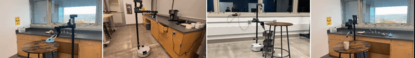
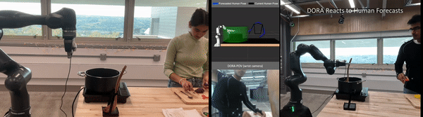
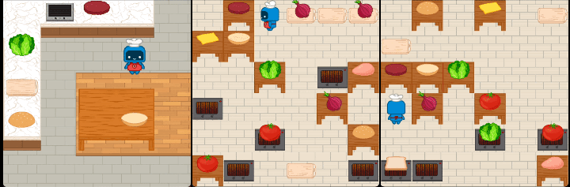

## **H**ome **A**pprentice **L**earner (HAL)

HAL aims to help humans automate daily tasks around the house. Since HAL is an apprentice, it can learn a new task, such as clean up after dinner, only from a few human demonstrations. HAL is also rumored to have an [evil twin](https://en.wikipedia.org/wiki/HAL_9000). 

[Follow our channel](https://www.youtube.com/channel/UCSVukhmD_xMMNeJT8wiLLMA) to see how we are building HAL!

## **D**extr**o**us **R**obot **A**pprentice (DORA)

DORA aims to help humans do dextrous tasks, like cooking, assembly and crafts. DORA too is an apprentice and can learn quickly from demonstrations. Thankfully, no evil twins to worry about here!

[Follow our channel](https://www.youtube.com/channel/UCSVukhmD_xMMNeJT8wiLLMA) to see how we are building DORA!

##  Robotouille

Robotouille is a customizable multi-task multi-agent cooking environment to benchmark high-level robot task planning. Try out [Robotouille](https://github.com/portal-cornell/robotouille) today! 

## Collaborative Manipulation Dataset (CoMaD)

CoMaD is a dataset of both human-human and human-robot interaction data with high-quality motion capture of human poses, robot poses and video of the scene. Download [CoMaD](https://github.com/portal-cornell/manicast/tree/release/data/comad_data) today!