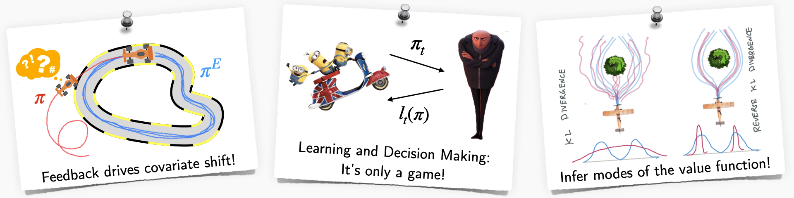

<!-- ## Cornell Courses
Undergraduate and graduate courses taught in Cornell -->

## CS 6756: Learning for Robot Decision Making (L4RD)
[https://www.cs.cornell.edu/courses/cs6756/2022fa/](https://www.cs.cornell.edu/courses/cs6756/2022fa/) (*starting Fall 2022!*)

Advances in machine learning have fueled progress towards deploying real-world robots from assembly lines to self-driving. Learning to make better decisions for robots presents a unique set of challenges. Robots must be safe, learn online from interactions with the environment, and predict the intent of their human partners. This graduate-level course dives deep into the various paradigms for robot learning and decision making. We look at:
1. **Interactive no-regret learning** as a fundamental framework for handling distribution shifts, hedging, exploration/exploitation.
2. **Imitation learning** from various modes of interaction (demonstrations, interventions) as a unified, game-theoretic framework.
3. **Practical reinforcement learning** that leverages both model predictive control and model-free methods.
4. **Open challenges** such as safety, causal confounds and offline learning.

This course focuses on algorithms, lessons from real world robotics and features a strong programming component.

 

## Imitation Learning: A Series of Deep Dives

In this 10-part series, we dive deep into imitation learning, and build up a general framework. A journey through feedback, interventions and more!

<iframe width="560" height="315" src="https://www.youtube.com/embed/videoseries?list=PLQZQ7N26C6ba2BDFVULmmBYC80cX6pNjZ" title="YouTube video player" frameborder="0" allow="accelerometer; autoplay; clipboard-write; encrypted-media; gyroscope; picture-in-picture" allowfullscreen></iframe>

 

## Core Concepts in Robotics

An introductory series that revisits core concepts in robotics in a contemporary light. 

<iframe width="560" height="315" src="https://www.youtube.com/embed/videoseries?list=PLQZQ7N26C6bbhXHuongGbbeVLl-PKkJ6K" title="YouTube video player" frameborder="0" allow="accelerometer; autoplay; clipboard-write; encrypted-media; gyroscope; picture-in-picture" allowfullscreen></iframe>

 

## Interactive Online Learning: A Unified Algorithmic Framework

In this series, we try to understand the fundamental fabric that ties all of robot learning -- "How can a robot learn from online interactions?" Our goal is to build up a unified mathematical framework to solve recurring problems in reinforcement learning, imitation learning, model predictive control, and planning. 

<iframe width="560" height="315" src="https://www.youtube.com/embed/videoseries?list=PLQZQ7N26C6ba-ifTijXwr2NXMkYbQe39O" title="YouTube video player" frameborder="0" allow="accelerometer; autoplay; clipboard-write; encrypted-media; gyroscope; picture-in-picture" allowfullscreen></iframe>

 

## CSE 490R: Mobile Robots (At UW)
[https://courses.cs.washington.edu/courses/cse490r/19sp/](https://courses.cs.washington.edu/courses/cse490r/19sp/)

Mobile Robots delves into the building blocks of autonomous systems that operate in the wild. We will cover topics related to state estimation (bayes filtering, probabilistic motion and sensor models), control (feedback, Lyapunov, LQR, MPC), planning (roadmaps, heuristic search, incremental densification) and online learning. Students will be forming teams and implementing algorithms on 1/10th sized rally cars as part of their assignments. Concepts from all of the assignments will culminate into a final project with a demo on the rally cars. The course will involve programming in a Linux and Python environment along with ROS for interfacing to the robot.

<iframe width="560" height="315" src="https://www.youtube.com/embed/Wnujho3YTv8" title="YouTube video player" frameborder="0" allow="accelerometer; autoplay; clipboard-write; encrypted-media; gyroscope; picture-in-picture" allowfullscreen></iframe>
